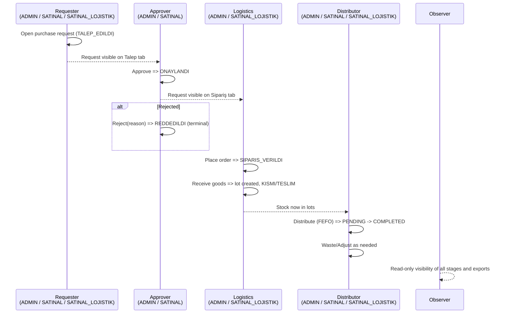
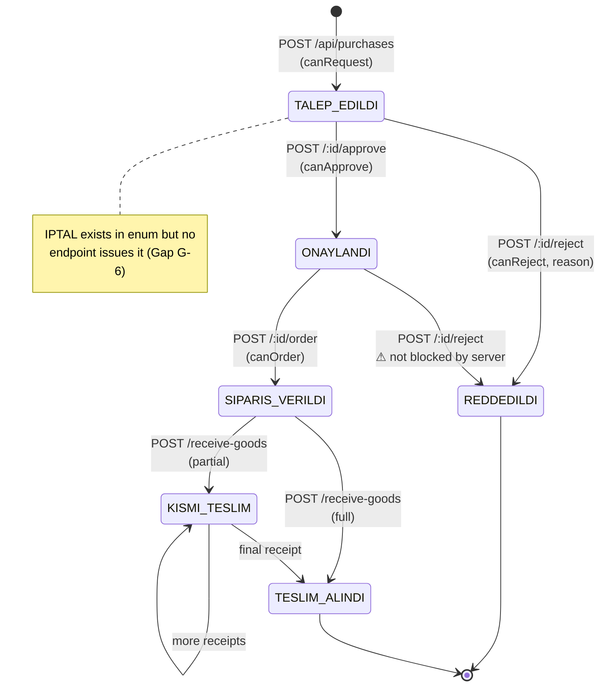
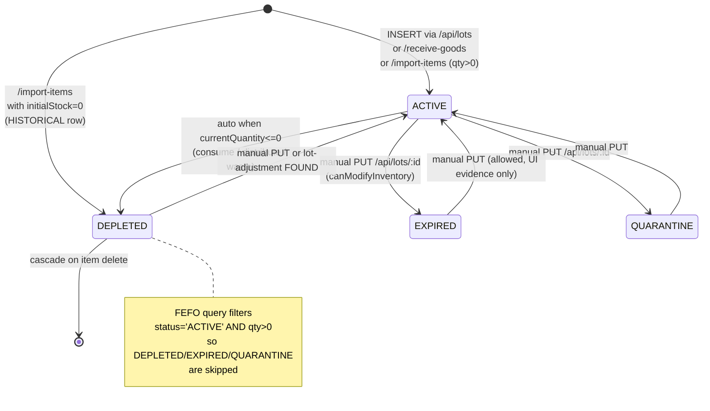
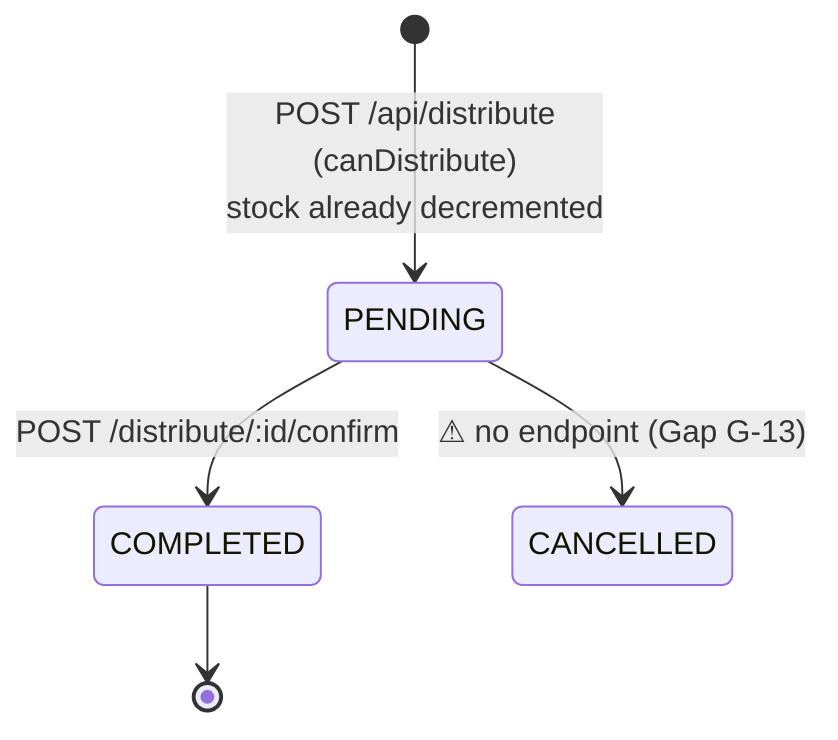

# PROCESS_DIAGRAMS

> Mermaid diagrams for every major flow. All based on confirmed middleware
> and route behaviour. Render with any Mermaid-enabled Markdown viewer.

## 1. Overall system workflow

```mermaid
flowchart TD
    A[User opens SPA] --> B{auth_token valid?}
    B -- no, no users --> C[Bootstrap form] --> C2[POST /api/auth/bootstrap\ncreate ADMIN] --> D
    B -- no, users exist --> L[Login form] --> L2[POST /api/auth/login] --> D
    B -- yes --> D[GET /api/auth/me]
    D --> E{role?}
    E -- ADMIN --> M[All tabs + Users + Excel Import + Clear All]
    E -- SATINAL --> M2[Stok, Talep, Sipariş, Dağıtım, Atık, LOT, SKT]
    E -- SATINAL_LOJISTIK --> M3[Stok, Talep, Dağıtım, Atık, LOT, SKT\n⚠ Sipariş tab hidden by UI]
    E -- OBSERVER --> M4[Stok, Talep (read), Dağıtım, SKT, Export only]

    M & M2 & M3 & M4 --> S[Item master created/imported]
    S --> PR[Purchase request raised]
    PR --> AP[Approve / Reject]
    AP -- ONAYLANDI --> OR[Order placed with supplier]
    AP -- REDDEDILDI --> END1((End))
    OR --> RC[Goods received -> lot]
    RC --> STK[Stock available in lots]
    STK --> DS[Distribute by FEFO]
    STK --> WS[Waste expired/damaged]
    STK --> ADJ[Manual adjustment]
    DS --> CF[Confirm distribution]
    CF --> END2((Closed))
```

## 2. New-item (purchase request) creation workflow

```mermaid
flowchart TD
    U[User: ADMIN / SATINAL / SATINAL_LOJISTIK] -->|opens Talep tab| UI[New Request form]
    O[OBSERVER] -.->|hidden by canViewTalep / canCreateRequest| X[(Blocked)]
    UI -->|fill itemId, requestedQty, department,\n urgency, notes, supplier?| V{Client validation}
    V -- missing --> UI
    V -- ok --> API[POST /api/purchases\nauthRequired + canRequest]
    API -->|authRequired fails| R401[401 UNAUTHORIZED]
    API -->|canRequest fails| R403[403 FORBIDDEN]
    API --> SV{Server validation:\nitemId? requestedQty>0?}
    SV -- fail --> R400[400 INVALID_INPUT]
    SV -- ok --> INS[INSERT purchases\nstatus='TALEP_EDILDI'\nrequestNumber=REQ-XXXXXX\nrequestedBy=user]
    INS --> RESP[200 { purchase }]
    RESP --> LIST[Row visible in Talep tab\nfor all non-observer roles]
    LIST --> NXT[Next actor: ADMIN / SATINAL]
```

## 3. New item definition (master) creation workflow

```mermaid
flowchart TD
    U[ADMIN / SATINAL / SATINAL_LOJISTIK] --> F[Yeni Malzeme Ekle form]
    F -->|code, name required\nothers optional| P[POST /api/item-definitions\nauthRequired]
    P --> V{code & name present?}
    V -- no --> E1[400 INVALID_INPUT]
    V -- yes --> U1[INSERT item_definitions\nstatus='ACTIVE',\nid=generateId(), createdBy=user]
    U1 -- duplicate code --> E2[409 DUPLICATE_CODE]
    U1 -- ok --> OK[200 { item }]
    OK --> LIST[Appears in Stok (totalStock=0)]
```

## 4. Existing purchase review / update workflow

```mermaid
flowchart TD
    L[GET /api/purchases] --> S{status?}

    S -- TALEP_EDILDI --> TA[Approver opens row]
    TA --> A1[POST /approve\ncanApprove = ADMIN / SATINAL]
    TA --> A2[POST /reject\ncanReject = ADMIN / SATINAL / SATINAL_LOJISTIK]
    A1 --> ONY[status=ONAYLANDI]
    A2 -- reason required --> RED[status=REDDEDILDI (terminal)]

    S -- ONAYLANDI --> OA[Logistics opens row]
    OA --> O1[POST /order\ncanOrder = ADMIN / SATINAL_LOJISTIK\nrequires supplierName + orderedQty]
    O1 --> ORD[status=SIPARIS_VERILDI]

    S -- SIPARIS_VERILDI --> RA[Logistics receives goods]
    RA --> R1[POST /receive-goods\ncanOrder\nbody: receivedQty, lotNumber, expiryDate...]
    R1 --> TX[(Transaction:\nINSERT/UPDATE lots,\nINSERT receipts,\nUPDATE purchases)]
    TX --> PRT{receivedQtyTotal >= orderedQty?}
    PRT -- no --> KT[status=KISMI_TESLIM]
    PRT -- yes --> TT[status=TESLIM_ALINDI]

    RED & TT --> END((terminal))
```

## 5. Existing item-definition / lot review workflow

```mermaid
flowchart TD
    L[GET /api/unified-stock] --> R[Row selected]
    R -->|canModifyInventory| EDIT[PUT /api/item-definitions/:id\n(COALESCE updates)]
    R -->|ADMIN only| DEL[DELETE /api/item-definitions/:id\nhard delete + cascade lots]
    R --> DR[Drill down GET /unified-stock/:id/lots]

    DR --> LR[Lot row]
    LR -->|canModifyInventory| LEDIT[PUT /api/lots/:id]
    LR -->|canDistribute| LADJ[POST /api/lot-adjustments\nsigned quantityChange]
    LR -->|canDistribute| LDIST[POST /api/distribute\nFEFO or explicit lotId]
    LR -->|canDistribute| LWASTE[POST /api/waste-with-lot]

    LDIST --> TX1[(tx: INSERT distributions PENDING,\nUPDATE lots FOR UPDATE,\nINSERT distribution_lots,\nINSERT usage_records)]
    TX1 --> CF[POST /distribute/:id/confirm\n-> COMPLETED]

    LWASTE --> TX2[(tx: UPDATE lot qty,\nINSERT waste_records)]
```

## 6. Role interaction / handoff diagram



## 7. Purchase status transition diagram



## 8. Lot status transition diagram



## 9. Distribution status transition diagram



## 10. Item-definition status transition diagram

```mermaid
stateDiagram-v2
    [*] --> ACTIVE: POST /api/item-definitions<br/>or /import-items
    ACTIVE --> INACTIVE: PUT /api/item-definitions/:id<br/>(status field)
    ACTIVE --> DISCONTINUED: PUT /api/item-definitions/:id
    INACTIVE --> ACTIVE: PUT
    DISCONTINUED --> ACTIVE: PUT (allowed; UI evidence only)
    ACTIVE --> [*]: DELETE (ADMIN; cascades)
    INACTIVE --> [*]: DELETE (ADMIN)
    DISCONTINUED --> [*]: DELETE (ADMIN)
    note right of INACTIVE
        Status is cosmetic:
        no stock query filters
        by item status
    end note
```


