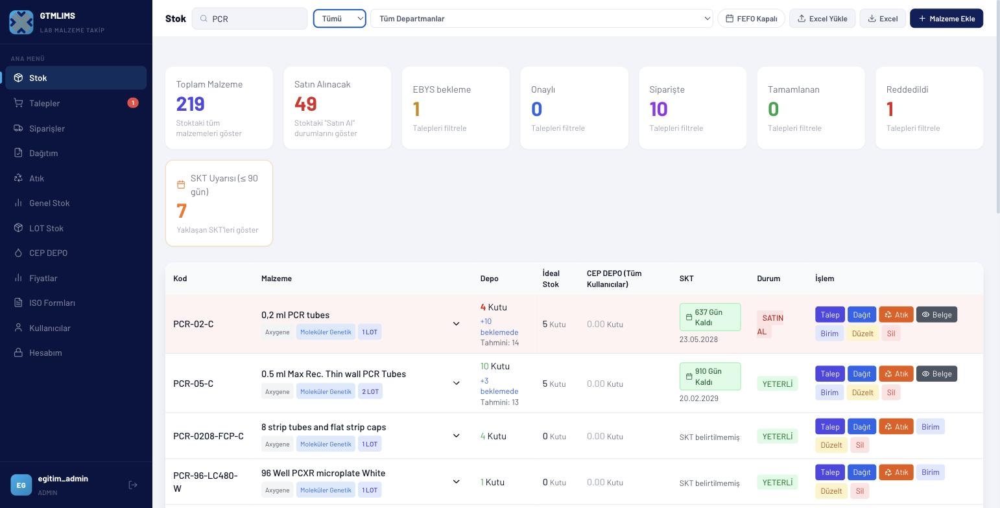
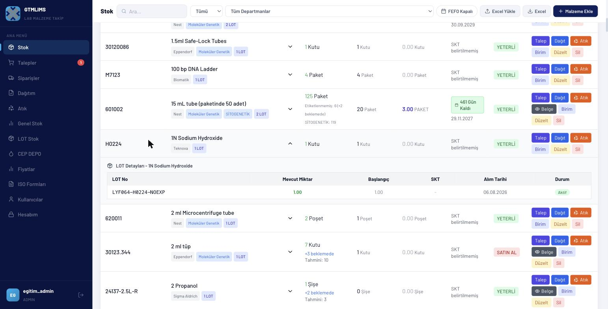
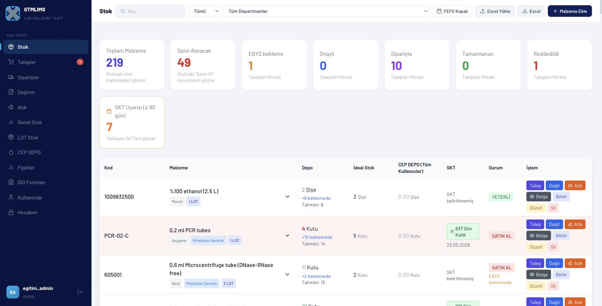

# Ortak başlangıç videosu

## Video kimliği

- **Başlık:** GTMLIMS'e Başlangıç — Giriş, Menü, Arama ve Güvenli Kullanım
- **Hedef kitle:** Bütün kullanıcı rolleri
- **Amaç:** Rol videolarında tekrarlanacak ortak arayüz davranışlarını tek videoda öğretmek
- **Tahmini süre:** 5-6 dakika

## Sahne planı ve seslendirme

### Sahne 1 — Güvenli giriş (00:00-01:00)

- **Tıklama:** Kullanıcı adı ve maskeli şifre; Giriş Yap.
- **Vurgu:** Hata mesajı, ilk kurulum bağlantısının normal kullanıcı için kullanılmaması.
- **Ekran yazısı:** `Kendi hesabınızla giriş yapın`
- **Seslendirme:** “GTMLIMS’e kullanıcı adımız ve kişisel şifremizle giriş yapıyoruz. Şifremizi başka kullanıcılarla paylaşmıyoruz. İlk kurulum bağlantısı yalnız boş bir sistemde ilk yönetici hesabı içindir; günlük kullanımda bu seçeneği açmıyoruz.”

### Sahne 2 — Sol menü ve rol kapsamı (01:00-02:00)

- **Tıklama:** Menü sayfaları üzerinde dolaş; kullanıcı kartı.
- **Vurgu:** Her rolün farklı menü görmesi.
- **Ekran yazısı:** `Menü rolünüze göre değişir`
- **Seslendirme:** “Sol menü hesabımızın rolüne ve açık modüllere göre oluşur. Başka bir eğitimde gördüğünüz sayfa sizde yoksa bu her zaman hata değildir. Sol alttaki kartta kullanıcı adımızı ve rolümüzü kontrol ediyoruz. Çıkış simgesi de aynı kartın sağındadır.”

### Sahne 3 — Arama ve filtreler (02:00-03:10)

- **Tıklama:** Üst Ara; Stokta/Satın Al; bölüm; Talepler'de durum/tarih/EBYS örneği.
- **Vurgu:** Arama terimi ve sayfaya özel filtreler.
- **Ekran yazısı:** `Önce ara, sonra filtrele`
- **Seslendirme:** “Üst çubuktaki Ara alanı açık sayfadaki kayıtları daraltır. Stok ekranında durum ve bölüm filtreleri; taleplerde durum, tarih ve EBYS araması bulunur. Sonuç bulamazsak önce arama metnini, sonra bölüm ve tarih filtrelerini temizleyerek tekrar deneriz.”

### Sahne 4 — Tablo, rozet ve ayrıntı (03:10-04:10)

- **Tıklama:** Stok satırını genişlet; durum ve SKT rozetlerini göster.
- **Vurgu:** Satır özeti ile LOT ayrıntısı farkı.
- **Ekran yazısı:** `Satırı aç; ayrıntıyı doğrula`
- **Seslendirme:** “Tablodaki renkli rozetler stok, talep veya LOT durumunu hızlıca gösterir. Yalnız renge bakmak yerine satırı genişletiyor; miktar, bölüm, LOT ve SKT ayrıntısını doğruluyoruz. Fiziksel işlem yaparken ekrandaki parti bilgisi ürün etiketiyle aynı olmalıdır.”

### Sahne 5 — Excel ve veri güvenliği (04:10-05:00)

- **Tıklama:** Yetkili bir sayfada Excel düğmesini göster; indirmeyi iptal edebilir.
- **Vurgu:** İndirilen raporun kurumsal veri olması.
- **Ekran yazısı:** `İndirilen raporu güvenli saklayın`
- **Seslendirme:** “Excel düğmesi ilgili listeyi raporlar. İndirilen dosyalar da sistem ekranı kadar hassas kabul edilmelidir. Dosyayı kişisel e-postaya, yetkisiz bulut alanına veya eğitim dışı paylaşım kanalına göndermiyoruz.”

### Sahne 6 — Hesabım ve çıkış (05:00-06:00)

- **Tıklama:** Hesabım; kullanıcı adı/rol; şifre formu; Temizle; çıkış.
- **Vurgu:** Sekiz karakter ve KALITE istisnası.
- **Ekran yazısı:** `Çalışma sonunda güvenli çıkış`
- **Seslendirme:** “Hesabım sayfası kullanıcı adımızı ve rolümüzü gösterir. Çoğu rol mevcut şifresini doğrulayarak en az sekiz karakterli yeni şifre belirleyebilir. KALITE rolündeki mevcut şifre formu bilinen bir tutarsızlık nedeniyle çalışmaz. İşimiz bittiğinde sol alttaki çıkış simgesini kullanıyoruz.”

## Sık hatalar

- Başka kişinin hesabıyla işlem yapmak
- Filtreyi açık bırakıp “kayıt yok” sanmak
- Ana depo ile CEP DEPO miktarını karıştırmak
- Renk rozetini ayrıntı kaydı yerine kullanmak
- İndirilen Excel'i yetkisiz paylaşmak
- Ortak bilgisayarda çıkış yapmadan ayrılmak

## Kapanış

“GTMLIMS’in ortak kullanımını tamamladık. Kendi rol videonuzda yalnız görevinize ait işlem adımlarını izleyin; görünmeyen veya yetkiniz dışında kalan işlevleri başka hesapla denemeyin.”

