# ADMIN eğitim videosu

## Video kimliği

- **Başlık:** GTMLIMS Yönetici Eğitimi — Kullanıcı, Stok, Süreç ve Sistem Ayarları
- **Hedef kitle:** Sistem yöneticileri ve uygulamanın operasyonel sahibi
- **Amaç:** Yönetici hesabıyla sistemi güvenli biçimde yapılandırmak; kullanıcı, malzeme, LOT, talep, teslim, dağıtım, düzeltme ve rapor akışlarını göstermek
- **Tahmini süre:** 22-24 dakika; ortak başlangıç videosu izlendiğinde 19-21 dakika
- **Doğrulama:** ADMIN hesabı canlı doğrulandı; API okumaları, 89 test ve üretim derlemesi başarılı

## Görev ve sorumluluklar

- Kullanıcıları oluşturmak, rollerini ve bölüm üyeliklerini yönetmek
- Bölüm adlarını ve aktiflik durumlarını yönetmek
- Modülleri ve iki sistem davranışını açıp kapatmak
- Malzeme tanımı, paket/alt birim ve stok hedeflerini yönetmek
- LOT, SKT, stok düzeltme ve gerektiğinde LOT bölme işlemlerini yapmak
- Talep, EBYS, teslim, dağıtım ve atık süreçlerinde istisnai yetki kullanmak
- ISO formlarını, fiyat/kullanım raporlarını ve genel stok göstergelerini izlemek
- Giriş kilitlerini yönetmek; yıkıcı işlemleri yalnız eğitim/boş ortamda kullanmak

## Gösterilecek sayfalar

Stok, Talepler, Siparişler, Dağıtım, Atık, Genel Stok, LOT Stok, CEP DEPO, Fiyatlar, ISO Formları, Kullanıcılar ve Hesabım. Barkod modülleri ve Teslim Onayı mevcut ayarda kapalı olduğu için gösterilmez.

## Örnek senaryo

Yönetici önce eğitim kullanıcısını SİTOGENETİK bölümüne `LAB_TECHNICIAN` rolüyle ekler. Ardından `EGT-PCR-001 — Eğitim PCR Kontrol Kiti` malzemesini TEST tüketim tipiyle tanımlar, güvenli bir LOT kaydı oluşturur ve stok hedeflerini kontrol eder. Teknik kullanıcının talebini onaylar; lojistik tesliminden sonra dağıtım ve rapor sonuçlarını inceler. Senaryonun sonunda ayarları ve güvenlik sınırlarını gösterir.

## Sahne sahne kayıt ve anlatım planı

### Sahne 1 — Giriş ve yönetici kapsamı (00:00-01:00)

- **Ekran/tıklama:** Giriş ekranında eğitim hesabını kullan; Giriş Yap. Sol menü ve kullanıcı kartını göster.
- **Vurgu:** Sol menü, rol etiketi `ADMIN`, çıkış simgesi.
- **Ekran yazısı:** `ADMIN — Sistem ve süreç yönetimi`
- **Seslendirme:** “Bu videoda GTMLIMS’in yönetici hesabını baştan sona ele alacağız. Eğitim ortamındaki ADMIN hesabıyla giriş yapıyoruz. Sol alttaki kullanıcı kartı, doğru hesap ve rolle çalıştığımızı doğruluyor. Yönetici tüm operasyon ekranlarını görebilir; ancak özellikle silme, stok düzeltme ve sistem ayarı gibi işlemler geri dönüşü zor sonuçlar doğurabileceği için kontrollü kullanılmalıdır.”

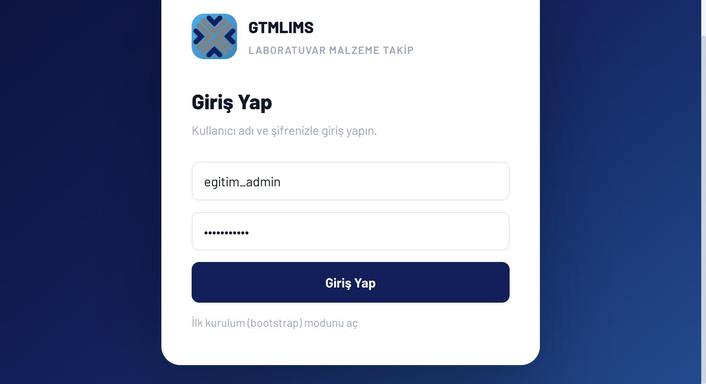

### Sahne 2 — Kullanıcı ve bölüm oluşturma (01:00-03:30)

- **Ekran/tıklama:** Sol menü > Kullanıcılar. Yeni bölüm adı alanına `SİTOGENETİK EĞİTİM` yaz; Bölüm Ekle. Kullanıcı adı `egitim_tekniker`, rol `LAB_TECHNICIAN`, bölüm `SİTOGENETİK EĞİTİM`; eğitim şifresini maskeli gir; Kullanıcı Oluştur.
- **Vurgu:** Rol açıklamaları, çoklu bölüm kutuları, lab teknisyeni için bölüm zorunluluğu.
- **Ekran yazısı:** `Önce bölüm, sonra kullanıcı`
- **Seslendirme:** “Şimdi sol menüden Kullanıcılar bölümüne giriyoruz. Lab teknisyenlerinin CEP DEPO kullanabilmesi için en az bir bölüme atanması gerekir. Önce eğitim bölümümüzü ekliyoruz. Ardından kullanıcı adını giriyor, rolü LAB_TECHNICIAN olarak seçiyor ve ilgili bölüm kutusunu işaretliyoruz. Şifre en az sekiz karakter olmalı. Kullanıcı Oluştur’a tıkladığımızda yeni hesap listede rolü ve bölüm bilgisiyle görünür.”

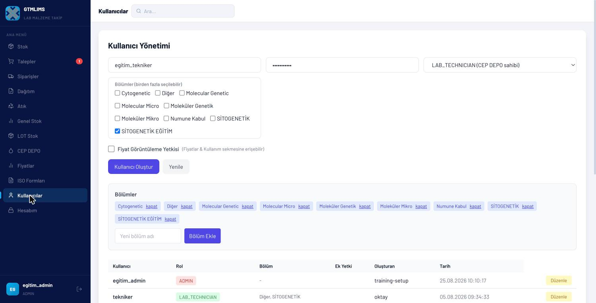

### Sahne 3 — Kullanıcıyı düzenleme ve ek yetkiler (03:30-05:00)

- **Ekran/tıklama:** Listede eğitim kullanıcısı > Düzenle. Bölüm üyeliğini göster, İptal. SATINAL örneğini seçerek Teslim Al Yetkisi ve Fiyat Görüntüleme Yetkisi alanlarını göster; kaydetme.
- **Vurgu:** Kullanıcı rolü ile ek yetkinin farkı.
- **Ekran yazısı:** `Rol + bölüm + ek yetki`
- **Seslendirme:** “Mevcut bir hesabı değiştirmek için satırın sonundaki Düzenle düğmesini kullanıyoruz. Rol, şifre ve bölüm üyelikleri bu formdan güncellenir. SATINAL rolü için ayrıca Teslim Al Yetkisi verilebilir. Fiyat ekranı da rolün varsayılan yetkisinden bağımsız olarak uygun kullanıcılara açılabilir. Eğitimde gereksiz ek yetki vermiyoruz; en az yetki ilkesiyle yalnız görev için gereken seçeneği etkinleştiriyoruz.”

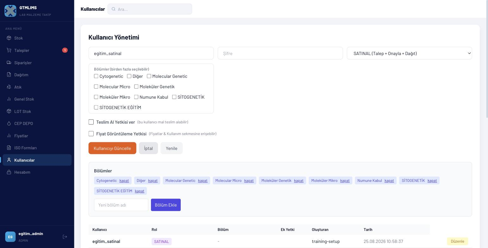

### Sahne 4 — Malzeme tanımı (05:00-08:00)

- **Ekran/tıklama:** Stok > Malzeme Ekle. Kod `EGT-PCR-001`, ad `Eğitim PCR Kontrol Kiti`, kategori `Reaktif`, bölüm `SİTOGENETİK EĞİTİM`, birim/paket `Kutu`, alt birim `Reaksiyon`, paket katsayısı `50`, tüketim `TEST`, eşik `3`, min/ideal/maks `2/4/8`, konum `Eğitim -20°C Dolap A1`, tedarikçi `Eğitim Medikal A.Ş.`, katalog `EGT-CAT-001`, not `Eğitim kaydıdır`; Kaydet.
- **Vurgu:** Kod/ad zorunluluğu, bölüm kapsamı, birim dönüşümü, stok hedefleri.
- **Ekran yazısı:** `Malzeme kartı stoktan önce gelir`
- **Seslendirme:** “Stok sayfasında sağ üstteki Malzeme Ekle düğmesine tıklıyoruz. Malzeme kodu ve adı zorunlu alanlardır. Bu örneği yalnız eğitim bölümüne açıyoruz. Ana birimi kutu, tüketim birimini reaksiyon olarak tanımlıyor ve bir kutuda elli reaksiyon bulunduğunu belirtiyoruz. TEST tüketim tipini seçiyoruz. Minimum reaksiyon eşiği üç olduğunda bölüm stoğu üç reaksiyonun altına düştüğünde yeni talep açılabilir. Son olarak stok hedeflerini, saklama yerini ve katalog bilgisini girip Kaydet’e tıklıyoruz.”

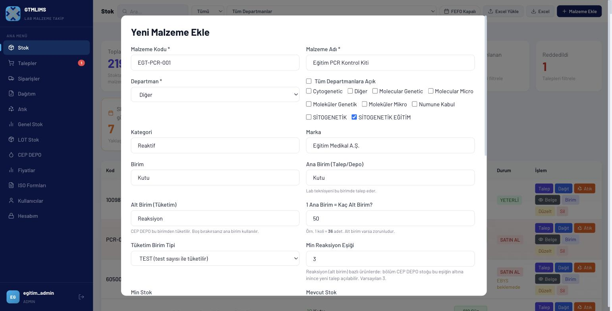

### Sahne 5 — LOT ve SKT (08:00-10:00)

- **Ekran/tıklama:** LOT Stok > Malzemeler > eğitim malzemesini ara > LOT Ekle. LOT `EGT-LOT-260825`, miktar `5`, üretici `Eğitim Üretici`, SKT `25.08.2027`, alım tarihi güncel, bölüm ve konum; Kaydet. Satırı aç, LOT'u göster.
- **Vurgu:** Fiziksel LOT numarası, miktar, SKT ve bölüm.
- **Ekran yazısı:** `Her fiziksel parti ayrı LOT`
- **Seslendirme:** “Malzeme tanımı ürün kartıdır; fiziksel stok ise LOT kayıtlarında tutulur. LOT Stok sayfasında ürünü bulup LOT Ekle’ye tıklıyoruz. Kutunun üzerindeki gerçek parti numarasını, miktarı ve son kullanma tarihini giriyoruz. Kaydettiğimizde stok bu LOT üzerinden artar. Aynı üründen farklı SKT’ye sahip ikinci bir parti gelirse yeni bir LOT daha açılmalıdır; miktarlar tek LOT altında birleştirilmemelidir.”

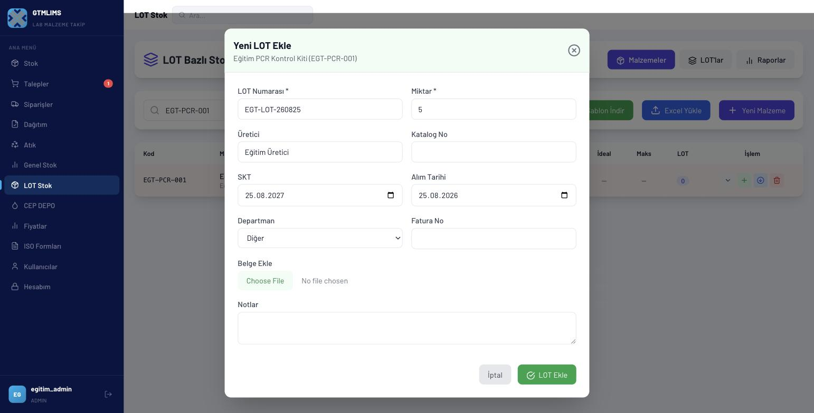

### Sahne 6 — Stok görünümü, FEFO ve düzeltme (10:00-12:30)

- **Ekran/tıklama:** Stok'a dön; arama ile ürünü bul; satırı genişlet. FEFO Açık. Düzelt'i aç; birim, hedef, LOT ve CEP bölüm alanlarını göster; değişiklik yapmadan İptal.
- **Vurgu:** Ana depo/CEP ayrımı, en yakın SKT, LOT seçimi, düzeltme kayıt disiplini.
- **Ekran yazısı:** `Düzeltme yalnız doğrulanmış sayım sonrası`
- **Seslendirme:** “Stok ekranında arama alanına eğitim kodunu yazıyoruz. Satırı genişlettiğimizde LOT ve SKT ayrıntıları görünür. FEFO’yu açmak, en yakın son kullanma tarihine sahip partiyi önce değerlendirmemize yardımcı olur. Düzelt düğmesi birim, stok ve CEP DEPO bakiyesini doğrudan değiştirebilir. Bu ekran yalnız fiziksel sayım veya doğrulanmış veri hatası sonrasında kullanılmalıdır. Birden fazla LOT varsa önce doğru LOT seçilir; burada değişiklik yapmadan İptal ile çıkıyoruz.”

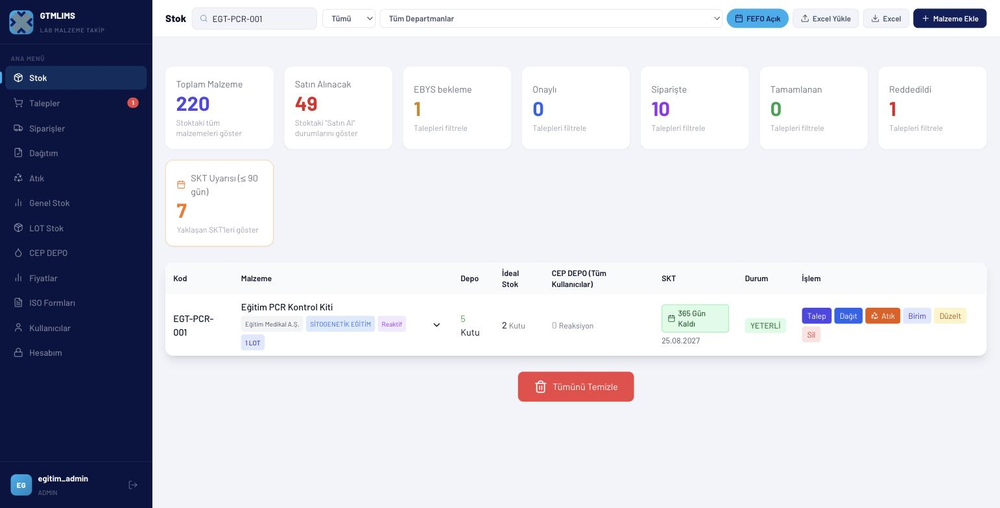

### Sahne 7 — Standart talep ve onay (12:30-14:30)

- **Ekran/tıklama:** Stok satırı > Talep; miktar `2`, Normal, not `Eğitim sipariş talebi`; Talep Oluştur. Talepler > durum Bekleyen > ilgili satır > Onayla; onay notu `Eğitim onayı`; Onayla.
- **Vurgu:** Talep numarası ve durum değişimi.
- **Ekran yazısı:** `Talep → Onay → Sipariş verilmiş`
- **Seslendirme:** “Şimdi aynı ürün için iki kutuluk örnek talep oluşturuyoruz. Miktarı ve açıklamayı girip Talep Oluştur’a tıklıyoruz. Sistem benzersiz bir talep numarası verir. Talepler sayfasında Bekleyen filtresini seçiyor ve satırdaki Onayla düğmesini açıyoruz. Onay notunu girdikten sonra işlemi tamamlıyoruz. Güncel sürümde standart onay, talebi doğrudan sipariş verilmiş durumuna taşır; ayrı bir sipariş formu beklenmez.”

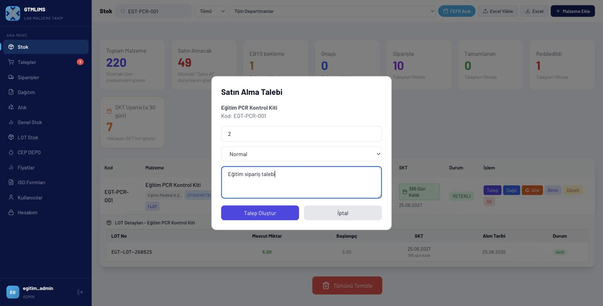

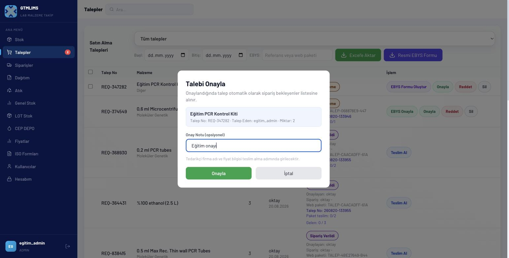

### Sahne 8 — EBYS paket mantığı (14:30-16:30)

- **Ekran/tıklama:** Bekleyen eğitim taleplerini işaretle; Resmi EBYS Formu; tarih/bölüm; İndir. Dosyanın manuel EBYS'ye yükleneceğini ekran başlığıyla anlat. Mevcut bir paket satırında EBYS Onayla düğmesini göster; gerçek onay yapma.
- **Vurgu:** Web paketi ile resmi form Talep No ayrımı.
- **Ekran yazısı:** `GTMLIMS indirir; EBYS yüklemesi manueldir`
- **Seslendirme:** “Birden fazla bekleyen kalem resmi talep formuna alınacaksa seçim kutularını kullanıyoruz. Resmi EBYS Formu’nu açıp tarih ve gerekirse bölüm seçiyoruz. GTMLIMS resmi Talep No’yu üretir; dosya adına, forma ve paket satırlarına kaydeder. İndirilen makrolu dosya kurumun EBYS sistemine manuel yüklenir. Dış onay tamamlandıktan sonra aynı kayıtlı Talep No ile paket onaylanır; yeni referans girişi yapılmaz.”

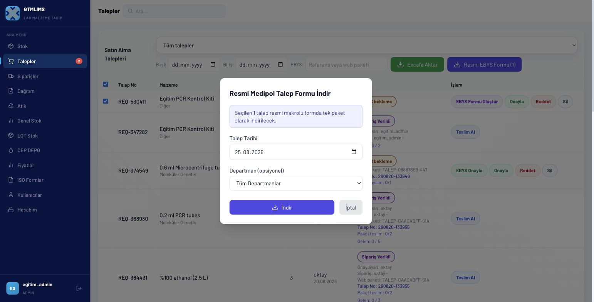

### Sahne 9 — Teslim, dağıtım ve atık kontrolü (16:30-19:00)

- **Ekran/tıklama:** Siparişler > örnek satır > Teslim Al formunu aç; alanları göster ve İptal. Dağıtım > bekleyen CEP talebi/LOT seçimi göster. Atık > kayıt tablosu ve Excel.
- **Vurgu:** Gelen miktar, LOT/SKT, belge sınırı; dağıtımda LOT toplamı; atık izlenebilirliği.
- **Ekran yazısı:** `Her stok hareketi doğru LOT'a bağlanır`
- **Seslendirme:** “Siparişler sayfasındaki Teslim Al işlemi yeni fiziksel stoğu oluşturur. Gelen miktar, teslim alan kişi ve LOT numarası zorunludur; SKT, fatura, tedarikçi, fiyat ve güvenli belge eklenebilir. Dağıtımda seçilen LOT miktarlarının toplamı dağıtım miktarıyla eşleşmelidir. Atık kaydı da aynı şekilde doğru LOT’tan düşülür ve sebep ile bertaraf yöntemi kayıt altına alınır. Böylece satın almadan kullanım ve bertarafa kadar izlenebilirlik korunur.”

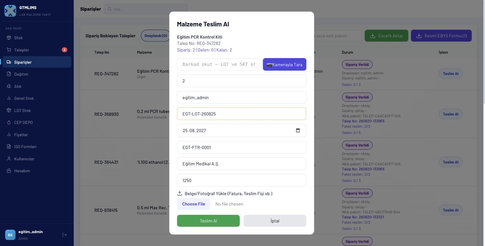

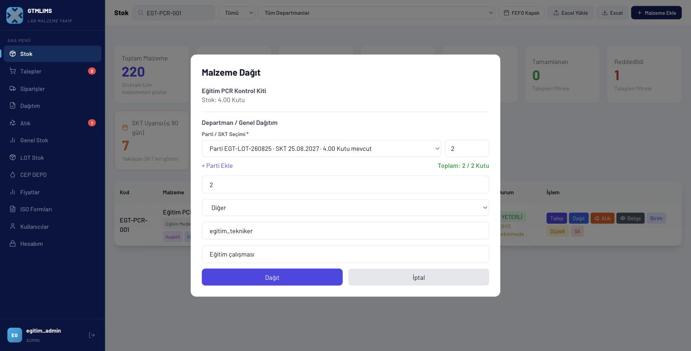

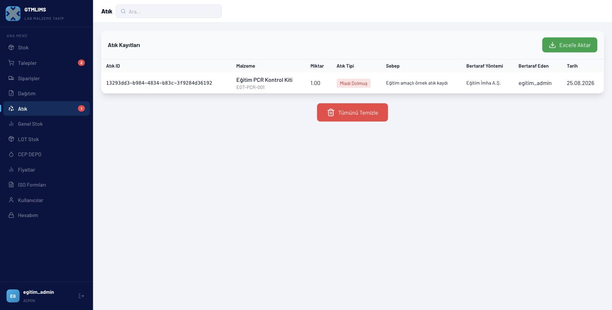

### Sahne 10 — Raporlar ve ISO (19:00-21:00)

- **Ekran/tıklama:** Genel Stok > Yenile; kartlar, departman tablosu, son aktiviteler. Fiyatlar > filtreleri ve Detay/Aylık/Departman. ISO Formları > LY-F064 bölüm seçimi; MG-F069 bölüm/yıl.
- **Vurgu:** LOT Stok Raporlar'ın güvenilir SKT kaynağı, ISO form parametreleri.
- **Ekran yazısı:** `Raporu amaç ve bölümle filtreleyin`
- **Seslendirme:** “Genel Stok sayfası toplamları, kritik stokları ve son hareketleri özetler. Fiyatlar sayfasında teslim kayıtlarını tedarikçi ve tarihe göre; kullanım kayıtlarını detay, aylık veya departman görünümünde inceleyebiliriz. Kontrollü formlar için ISO Formları’na giriyoruz. LY-F064’te bölüm, MG-F069’da bölüm ve yıl seçilmeden indirme başlamaz. SKT ayrıntısını doğrularken LOT Stok içindeki Raporlar görünümünü esas alın.”

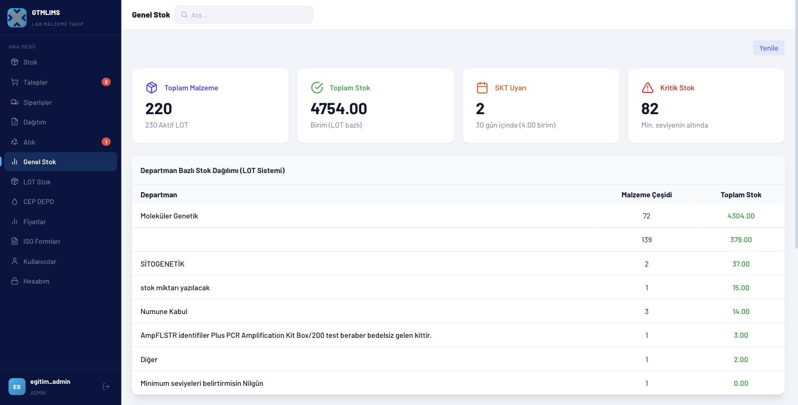

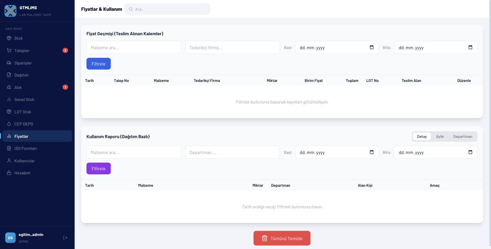

### Sahne 11 — Sistem ayarları ve güvenlik (21:00-23:00)

- **Ekran/tıklama:** Hesabım. Teslim onayı ve bölüm bazlı depo ayrımı açıklamalarını göster; modül listesinde barkodların kapalı olduğunu göster, değiştirme. Şifre formu. Kullanıcılar > Giriş Kilitleri.
- **Vurgu:** Ayar değişikliğinin tüm kullanıcıları etkilemesi, sekiz karakter kuralı, kilit kaldırma.
- **Ekran yazısı:** `Ayar değişikliği tüm sistemi etkiler`
- **Seslendirme:** “Hesabım sayfasında yöneticiye özel sistem ayarları bulunur. Teslim onayı açılırsa dağıtım iki adımlı hale gelir; bölüm bazlı depo ayrımı açılırsa stok havuzları bölüm bazında ayrılır. Modül anahtarları sol menü görünürlüğünü değiştirir. Bu eğitimde barkod modülleri kapalı kalıyor. Şifre en az sekiz karakter olmalı. Kullanıcılar sayfasındaki Giriş Kilitleri bölümünden yalnız doğrulanmış bir kilit durumunda ilgili IP’nin kilidi kaldırılır.”

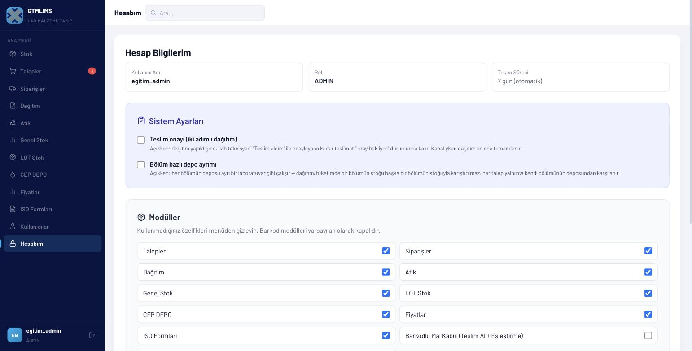

### Sahne 12 — Kapanış ve yıkıcı işlemler (23:00-24:00)

- **Ekran/tıklama:** Alt bölümde Tümünü Temizle düğmesini kadraja al; tıklama. Çıkış simgesini göster.
- **Vurgu:** Tümünü Temizle ve silme işlemlerinin eğitim/üretim ayrımı.
- **Ekran yazısı:** `Tümünü Temizle: yalnız boş eğitim ortamı`
- **Seslendirme:** “Son olarak kritik bir güvenlik uyarısı: Tümünü Temizle ve kalıcı silme işlemleri üretim ortamında rutin işlem değildir. Bu düğmeye videoda tıklamıyoruz. Eğitim tamamlandığında sol alttaki çıkış simgesini kullanıyoruz. Yönetici olarak temel sorumluluğunuz, doğru rolü doğru kullanıcıya vermek ve her stok hareketinin doğru malzeme, bölüm ve LOT ile kaydedildiğini doğrulamaktır.”

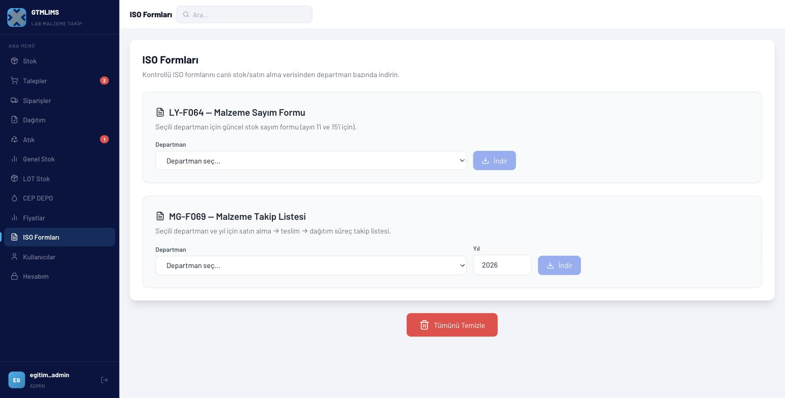

## Dikkat noktaları ve sık hatalar

- Gerçek operasyon verisinde Tümünü Temizle kullanılmaz.
- Lab teknisyeni bölüm ataması olmadan CEP DEPO kullanamaz.
- Paket/alt birim katsayısı sonradan değiştirilirse CEP bakiyeleri yeniden hesaplanır; fiziksel sayımla doğrulayın.
- Aynı fiziksel ürünün farklı SKT'lerini tek LOT'a yazmayın.
- Düzeltme ile normal teslim/dağıtım akışını ikame etmeyin.
- EBYS web paketi ile resmi formun Talep No'sunu karıştırmayın.
- Üst SKT sayacını tek başına denetim kaynağı saymayın; LOT Raporlarıyla kontrol edin.
- SATINAL/KURUMSAL/KALITE ekranlarında görünen her düğmenin çalıştığını varsaymayın; sorun raporundaki rol uyumsuzluklarını dikkate alın.

## Kapanış metni

“Bu eğitimde kullanıcı ve bölüm yönetiminden malzeme ve LOT tanımına, talep ve EBYS sürecinden teslim, dağıtım, atık ve raporlamaya kadar yönetici akışını tamamladık. İşlemlerde doğru rolü, doğru bölümü ve doğru LOT’u seçmek sistemin izlenebilirliğinin temelidir. Çalışmanız bittiğinde güvenli şekilde çıkış yapmayı unutmayın.”

## Kurgu notları

- Şifre girişini kesme ile gizleyin; gerçek parola ekranda veya seslendirmede yer almasın.
- Silme/Tümünü Temizle sahnesinde kırmızı çerçeve ve “Tıklamayın” çağrısı kullanın.
- Onay sonrası durum rozetine 1,5 saniyelik yakınlaştırma ekleyin.
- EBYS sahnesinde dış sistem ekranı kullanılmıyorsa basit “Manuel EBYS yüklemesi” ara kartı gösterin; sahte EBYS ekranı üretmeyin.
