# SATINAL eğitim videosu

## Video kimliği

- **Başlık:** GTMLIMS SATINAL Eğitimi — Talep, Onay, EBYS ve CEP DEPO
- **Hedef kitle:** Satın alma talep ve onay sorumluları
- **Amaç:** Stok ihtiyacını değerlendirmek, standart ve CEP taleplerini onaylamak/reddetmek, resmi EBYS formu oluşturmak ve yetkili dağıtım işlemlerini göstermek
- **Tahmini süre:** 14-15 dakika
- **Doğrulama:** SATINAL hesabı canlı doğrulandı. Mevcut hesapta Teslim Al ve Fiyat Görüntüleme ek yetkileri kapalıdır.

## Görev ve sorumluluklar

- Stok, kritik seviye ve açık talepleri izlemek
- Standart satın alma talebi oluşturmak
- Bekleyen talepleri gerekçeli biçimde onaylamak veya reddetmek
- Bekleyen kalemleri resmi EBYS formunda paketlemek
- Lab teknisyeni CEP taleplerini onaylamak/reddetmek
- Ana depodan dağıtım, atık ve CEP dağıtımı yapmak
- Kullanıcı, sistem ayarı, ISO formu ve fiyat sayfasını yönetmemek
- Ek Teslim Al yetkisi verilmedikçe mal kabul yapmamak

## Gösterilecek sayfalar

Stok, Talepler, Dağıtım, Atık, Genel Stok, LOT Stok, CEP DEPO ve Hesabım. Siparişler, Fiyatlar, ISO Formları ve Kullanıcılar mevcut hesapta görünmez.

## Örnek senaryo

`EGT-PCR-001` ürününün stok hedefinin altında olduğu görülür. SATINAL iki kutuluk talep açar, talebi inceler ve onaylar. İkinci bir talebi resmi EBYS formuna ekler. Ardından lab teknisyeninin CEP talebini onaylayıp doğru LOT'tan dağıtır ve kayıtları kontrol eder.

## Sahne planı ve seslendirme

### Sahne 1 — Giriş ve menü (00:00-00:50)

- **Tıklama:** Eğitim SATINAL hesabıyla giriş; doğrudan açılan Satın Alma İş Merkezi, kullanıcı kartı ve menü.
- **Vurgu:** Siparişler ve Kullanıcılar menüsünün olmaması.
- **Ekran yazısı:** `SATINAL — Talep ve onay sorumlusu`
- **Seslendirme:** “SATINAL hesabıyla giriş yaptığımızda doğrudan satın alma iş merkezine geliriz. Yeni Talep Aç, EBYS Formu Hazırla, Siparişleri İzle ve Tüm Süreci Gör görevlerinden yapmak istediğimizi seçeriz. Kullanıcı yönetimi ve sistem ayarları bu rolün sorumluluğunda değildir.”

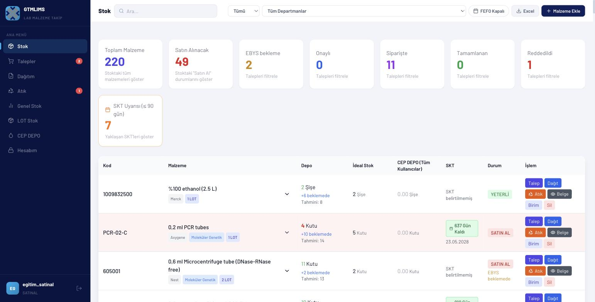

### Sahne 2 — İhtiyacı değerlendirme (00:50-02:20)

- **Tıklama:** Stok > durum `Satın Al`; bölüm `SİTOGENETİK EĞİTİM`; arama `EGT-PCR-001`; satırı genişlet.
- **Vurgu:** Ana depo, ideal/min hedef, bekleyen sipariş, CEP DEPO ve SKT.
- **Ekran yazısı:** `Talep öncesi stok ve açık siparişi kontrol et`
- **Seslendirme:** “Stok ekranında önce Satın Al filtresini, ardından ilgili bölümü seçiyoruz. Talep açmadan önce ana depo miktarını, hedef stoğu, bekleyen sipariş miktarını ve bölüm CEP DEPO bakiyesini birlikte kontrol ediyoruz. Satırı genişleterek kullanılabilir LOT ve SKT bilgilerini de inceliyoruz. Aktif bir talep veya yeterli bekleyen miktar varsa ikinci bir talep oluşturmuyoruz.”

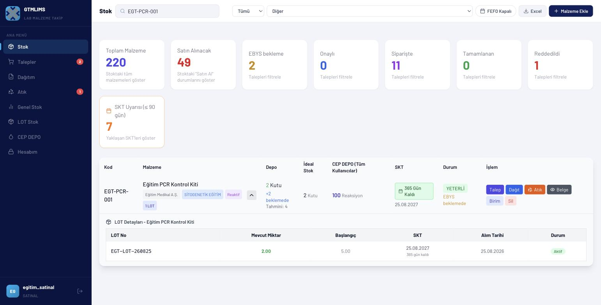

### Sahne 3 — Standart talep oluşturma (02:20-03:30)

- **Tıklama/veri:** Satın Alma İş Merkezi > Yeni Talep Aç; malzemeyi ara/seç; miktar `2`, bölüm, aciliyet `Normal`, not `Eğitim stok tamamlama talebi`; Talebi Oluştur.
- **Vurgu:** Miktar, aciliyet, not.
- **Ekran yazısı:** `Gerekçeli ve ölçülü talep`
- **Seslendirme:** “İhtiyaç doğrulandıktan sonra Yeni Talep Aç’a tıklıyoruz. İlk adımda malzemeyi adı, kodu, katalog numarası veya barkoduyla buluyoruz. İkinci adımda miktarı, bölümü, aciliyeti ve kısa açıklamayı yazıyoruz. Sistem talep numarasını üretir ve yeni kaydı EBYS formu için otomatik seçer.”

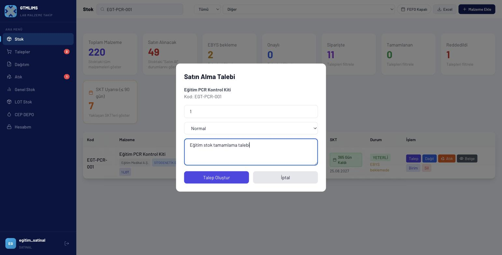

### Sahne 4 — Talep filtreleri ve inceleme (03:30-05:00)

- **Tıklama:** Talepler; durum `Bekleyen`; başlangıç/bitiş tarihi; EBYS arama alanını göster; satırı incele.
- **Vurgu:** Talep eden, bölüm, miktar, acil etiketi, mevcut paket bilgisi.
- **Ekran yazısı:** `Onaydan önce kim, ne, ne kadar?`
- **Seslendirme:** “Talepler sayfasında durum filtresini Bekleyen olarak seçiyoruz. Tarih alanları belirli bir dönemi, EBYS alanı ise dış referans veya web paketini bulmak için kullanılır. Onaydan önce malzeme adı, bölüm, talep eden kişi, miktar ve varsa ACİL etiketi mutlaka kontrol edilmelidir.”

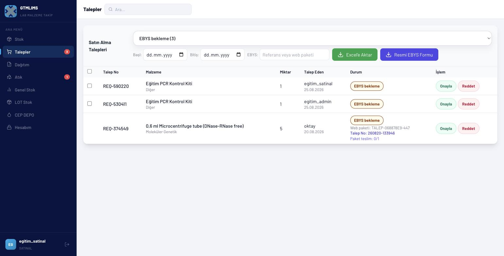

### Sahne 5 — Onay ve red (05:00-06:40)

- **Tıklama/veri:** Örnek satır > Onayla; not `Stok ihtiyacı doğrulandı`; Onayla. Başka eğitim satırında Reddet; neden `Mevcut açık sipariş yeterli`; onaylamadan önce red uyarısını göster.
- **Vurgu:** Durum rozetinin değişmesi; red gerekçesinin kaydı.
- **Ekran yazısı:** `Kararı açıklayan kısa not bırakın`
- **Seslendirme:** “Uygun talepte Onayla düğmesini açıyor, ihtiyacın doğrulandığını belirten kısa notu yazıyoruz. Güncel standart akışta bu işlem kaydı doğrudan sipariş verilmiş durumuna taşır. Talep gereksizse Reddet’i seçiyoruz ve mutlaka açık bir gerekçe yazıyoruz. Örneğin mevcut açık sipariş yeterliyse bunu red nedeni olarak kaydediyoruz.”

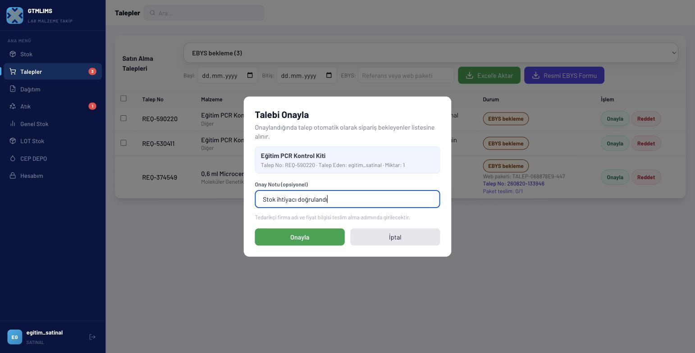

### Sahne 6 — Resmi EBYS formu (06:40-08:40)

- **Tıklama:** EBYS Formu Hazırla; Görünen Talepleri Seç; Seçilen Talepleri Form Yap; Resmi Formu İndir.
- **Vurgu:** Toplu seçim, 343 satır sınırı, web paket kimliği ve resmi Talep No.
- **Ekran yazısı:** `Form indir → EBYS'ye manuel yükle`
- **Seslendirme:** “EBYS Formu Hazırla görevi yalnız paketlenmemiş talepleri gösterir. Görünen talepleri tek düğmeyle seçip Seçilen Talepleri Form Yap diyoruz. Penceredeki üç adım formu indirmeyi, kurumun dış EBYS sistemine yüklemeyi ve onay geldiğinde lojistiğin geri dönmesini açıkça gösterir. Sistem Talep No’yu üretip makrolu dosyaya ve paket satırlarına kaydeder.”

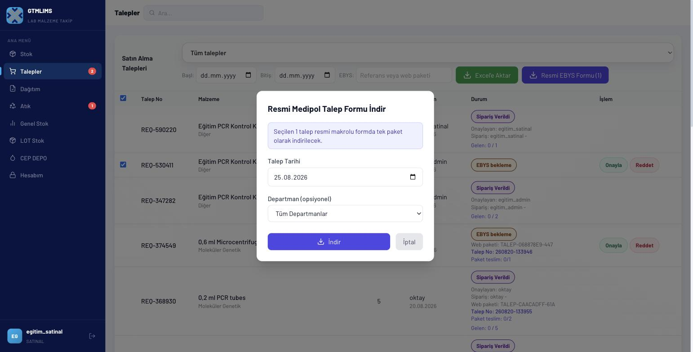

### Sahne 7 — CEP talebini onaylama (08:40-10:40)

- **Tıklama:** CEP DEPO > Onay Bekleyen Lab Teknisyeni Talepleri; talebi incele; Onayla; not `Bölüm bakiyesi doğrulandı`.
- **Vurgu:** Talep eden/teknisyen, bölüm, miktar, stok kuralı.
- **Ekran yazısı:** `CEP talebi bölüm bakiyesine bağlıdır`
- **Seslendirme:** “CEP DEPO sayfasında onay bekleyen lab teknisyeni taleplerini görüyoruz. Ürün, miktar, hedef teknisyen ve bölümü kontrol ediyoruz. Normal ürünlerde teknisyen bölüm stoğu sıfırlanmadan yeni talep açamaz; reaksiyon ürünlerinde eşik kuralı uygulanır. Uygun talebi Onayla ile dağıtım bekleyen duruma geçiriyoruz.”

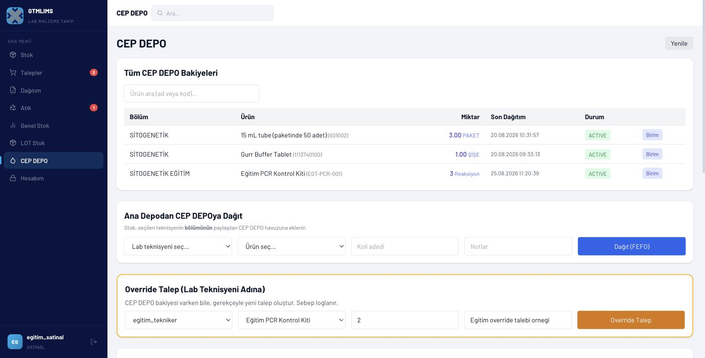

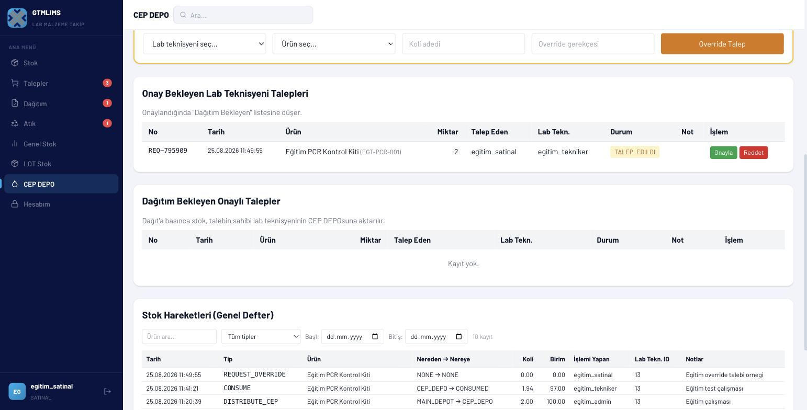

### Sahne 8 — CEP dağıtımı (10:40-12:20)

- **Tıklama:** Dağıtım bekleyen onaylı talep > Dağıt; veya Dağıtım sayfası > LOT seç > miktar; Onayla & Dağıt.
- **Vurgu:** Fiziksel LOT/SKT ile ekrandaki seçimin eşleşmesi.
- **Ekran yazısı:** `Doğru kutu, doğru LOT, doğru bölüm`
- **Seslendirme:** “Onaylı talebi dağıtırken ekrandaki ürünle elimizdeki fiziksel kutuyu karşılaştırıyoruz. Parti numarası ve SKT aynı olan LOT’u seçiyor, verilecek miktarı giriyor ve Onayla ve Dağıt’a tıklıyoruz. İşlem ana depodan düşer, hedef bölümün CEP DEPO bakiyesine eklenir ve hareket defterine kimin yaptığı kaydedilir.”

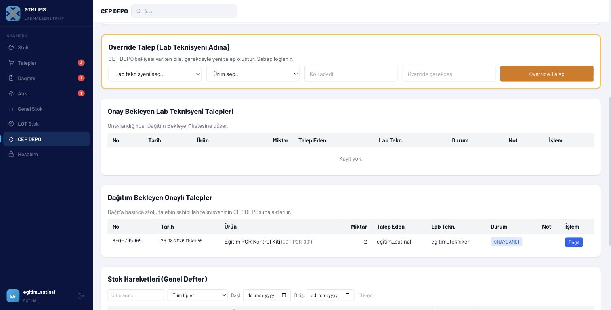

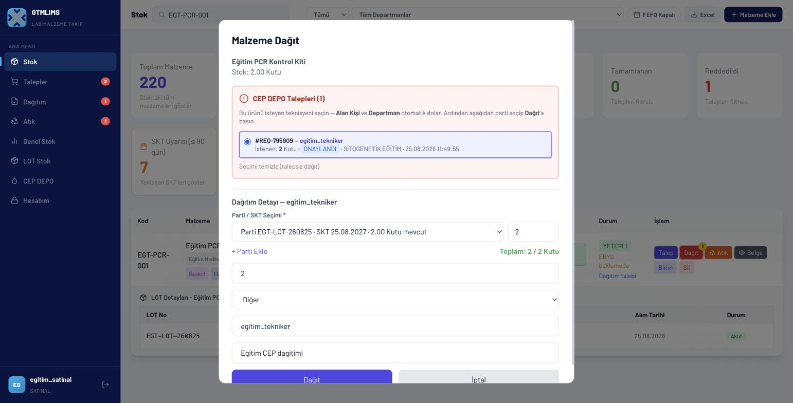

### Sahne 9 — Genel dağıtım ve atık (12:20-13:40)

- **Tıklama:** Stok satırı > Dağıt formunda bölüm, alan kişi, amaç; iptal. Stok > Atık formunda alanları göster; iptal. Atık > Excel.
- **Vurgu:** LOT toplam kontrolü ve atık gerekçesi.
- **Ekran yazısı:** `Stok çıkışı iz bırakmalıdır`
- **Seslendirme:** “Talep dışı genel dağıtımda bölüm, alan kişi ve kullanım amacı boş bırakılmamalıdır. Parti satırlarının toplamı dağıtım miktarıyla eşleşmeden düğme etkinleşmez. Kullanılamayan malzeme için Atık formunda doğru LOT, atık tipi, sebep ve bertaraf yöntemi seçilir. Kayıtlar Atık sayfasından Excel’e aktarılabilir.”

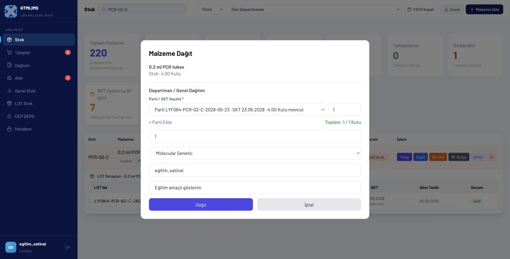

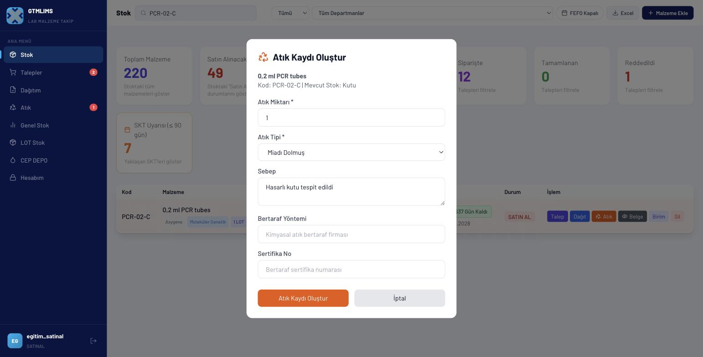

### Sahne 10 — Rapor, hesap ve kapanış (13:40-15:00)

- **Tıklama:** Genel Stok > Yenile; Hesabım > şifre alanları; çıkış.
- **Vurgu:** SATINAL'ın ISO/Fiyat/Kullanıcı erişiminin olmaması.
- **Ekran yazısı:** `Talebi izleyin, sonucu doğrulayın`
- **Seslendirme:** “Genel Stok ekranında kritik stok ve son hareketleri kontrol ederek açtığımız taleplerin operasyonel sonucunu izliyoruz. Hesabım sayfasından şifremizi değiştirebiliriz; yeni şifre en az sekiz karakter olmalıdır. SATINAL rolü kullanıcı ve sistem ayarı yapmaz, mevcut ek yetkiler olmadan teslim veya fiyat işlemi gerçekleştirmez. İşimiz bittiğinde güvenli şekilde çıkış yapıyoruz.”

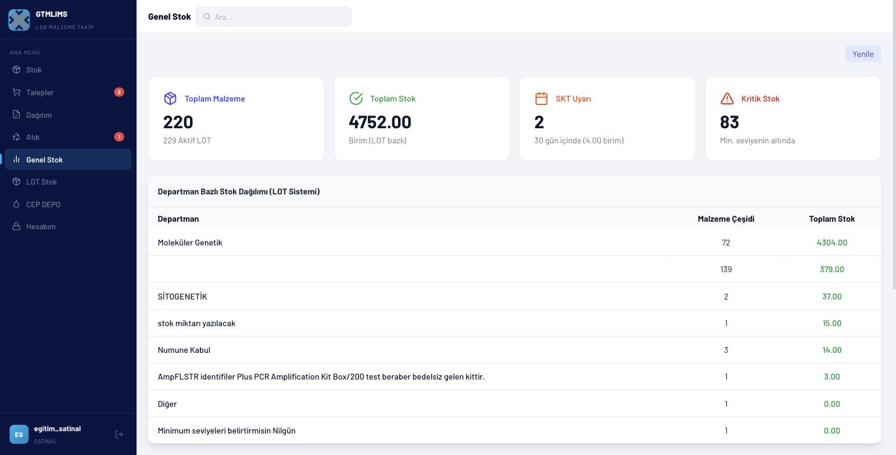

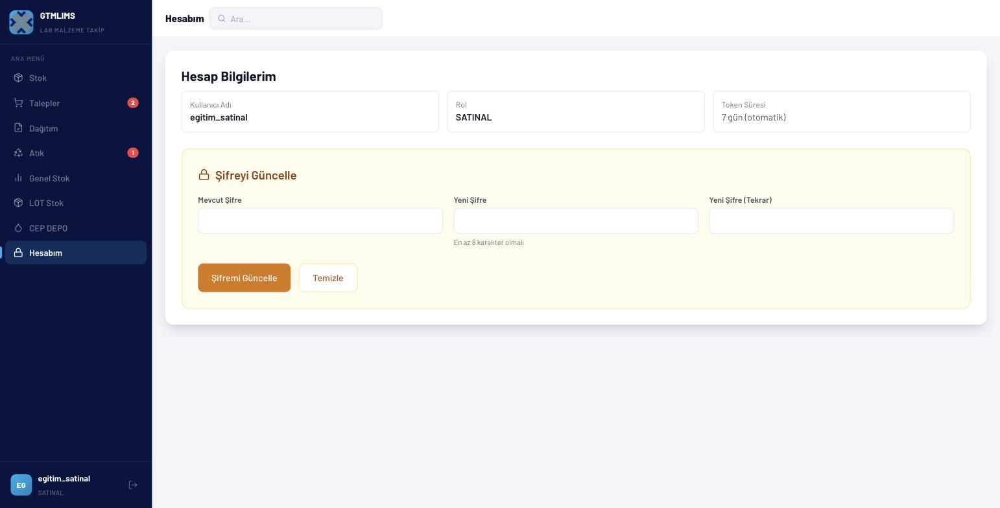

## Dikkat noktaları ve hatalar

- Onay, standart akışta doğrudan sipariş verilmiş durumuna geçer; “ayrıca siparişe alacağım” diye beklemeyin.
- Aynı ürün için açık talep ve bekleyen sipariş varken mükerrer kayıt açmayın.
- Resmi EBYS formunu indirmek EBYS'ye gönderim veya dış onay anlamına gelmez.
- LOT Stok'taki LOT Ekle düğmesi ek Teslim Al yetkisi olmayan SATINAL için API tarafından reddedilir; videoda kullanılmaz.
- Yeni talep oluşturulduğunda kayıt EBYS formu için otomatik seçilir; aynı talebi yeniden seçmeye çalışmayın.
- Fiyatlar ve ISO sayfası bu eğitim hesabında yoktur.
- Red gerekçesini boş veya kişisel yorum şeklinde yazmayın; ölçülebilir nedeni belirtin.

## Kapanış metni

“SATINAL rolüyle stok ihtiyacını doğruladık, talep oluşturduk, onay ve red kararlarını kaydettik, resmi EBYS formunu hazırladık ve CEP DEPO dağıtımını izledik. Doğru karar için her zaman mevcut stok, açık sipariş, bölüm bakiyesi ve LOT bilgisini birlikte değerlendirin.”
