# SATINAL_LOJISTIK eğitim videosu

## Video kimliği

- **Başlık:** GTMLIMS Lojistik Eğitimi — EBYS Onayı, Mal Kabul, LOT ve Dağıtım
- **Hedef kitle:** Sipariş/EBYS takibi, mal kabul ve ana depo dağıtımından sorumlu personel
- **Amaç:** EBYS paketini siparişe almak, kısmi/tam teslim kaydetmek, LOT/SKT doğrulamak, ana depo ve CEP dağıtımlarını tamamlamak, ISO çıktısı almak
- **Tahmini süre:** 17-18 dakika
- **Doğrulama:** SATINAL_LOJISTIK hesabı canlı doğrulandı; mevcut hesapta Fiyat Görüntüleme ek yetkisi yoktur.

## Görev ve sorumluluklar

- Gerektiğinde görev merkezinden yeni standart satın alma talebi oluşturmak
- Bekleyen talepler için resmi EBYS formu oluşturmak
- GTMLIMS'in resmi form için ürettiği Talep No'yu kontrol edip, dış EBYS onayı tamamlanan paketi siparişe almak
- Sipariş edilmiş malzemeleri kısmi veya tam teslim almak
- Gelen fiziksel ürünün LOT, SKT, miktar ve belgesini doğrulamak
- LOT SKT düzenleme ve yeni LOT oluşturma işlemlerini yapmak
- Ana depodan genel veya CEP DEPO dağıtımı yapmak; atık kaydetmek
- LY-F064 ve MG-F069 formlarını indirmek
- Standart talebi Onayla/Reddet kararını vermemek; kullanıcı yönetimi yapmamak

## Gösterilecek sayfalar

Stok, EBYS İşleri, Mal Kabul, Dağıtım, Atık, Genel Stok, LOT Stok, CEP DEPO, ISO Formları ve Hesabım. Fiyatlar ve Kullanıcılar görünmez; barkod modülleri kapalıdır.

## Örnek senaryo

Bekleyen `EGT-PCR-001` talebi resmi form olarak indirilmiş; GTMLIMS formda kullanılacak Talep No'yu üretmiş ve dosya dış EBYS'ye manuel yüklenerek onaylanmıştır. Lojistik bu paketi Dış EBYS Onayı Geldi işlemiyle siparişe alır. Beş kutuluk siparişin önce üç, sonra iki kutusunu farklı LOT'larla teslim alır. Ardından iki kutuyu teknisyenin CEP DEPOsuna doğru LOT'tan dağıtır ve ISO takip formunu indirir.

## Sahne planı ve seslendirme

### Sahne 1 — Giriş ve görev ayrımı (00:00-01:00)

- **Tıklama:** Lojistik eğitim hesabıyla giriş; doğrudan açılan üç sık kullanılan işlemi göster.
- **Ekran yazısı:** `Lojistik — EBYS, teslim ve dağıtım`
- **Seslendirme:** “SATINAL_LOJISTIK hesabıyla giriş yaptığımızda yalnız üç sık kullanılan işlem öne çıkar. Kullanım sırasına göre önce Mal Dağıtımı, sonra EBYS Sonrası Onay ve son olarak Mal Teslim Al bulunur. Yeni talep, EBYS formu hazırlama ve geçmiş kayıtlar kapalı Diğer İşlemler alanında kalır. Standart talebin iş gerekçisini onaylamak bu rolün görevi değildir.”

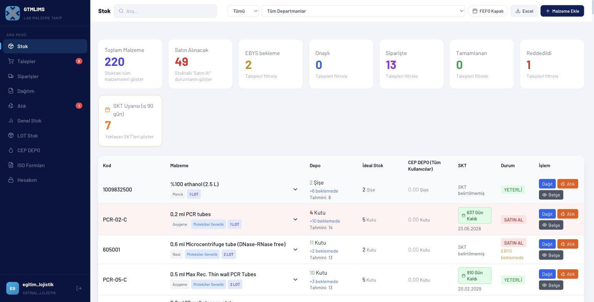

### Sahne 2 — Bekleyen talebi ve EBYS paketini bulma (01:00-02:30)

- **Tıklama:** EBYS Sonrası Onay görevini seç; gerekirse Diğer İşlemler > EBYS formu hazırla veya Filtre ve Excel > EBYS alanını kullan.
- **Vurgu:** Talep No, web paketi, resmi form Talep No ve durum.
- **Ekran yazısı:** `Web paketi ≠ EBYS Talep No`
- **Seslendirme:** “Görev düğmeleri listeyi bizim için otomatik süzer. EBYS Formu Hazırla yalnız paketlenmemiş talepleri, Dış EBYS Onayı Geldi yalnız hazırlanmış paketleri gösterir. Eski bir kaydı bulmak gerekirse Filtre ve Excel alanından tarih veya EBYS aramasını açabiliriz.”

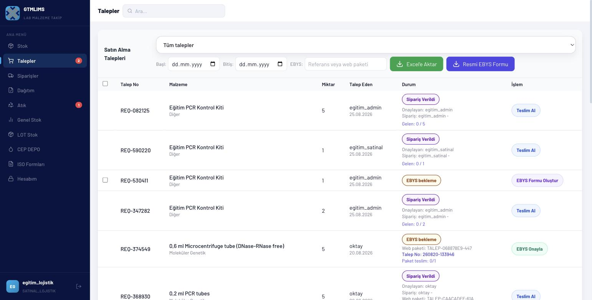

### Sahne 3 — Resmi formu oluşturma (02:30-04:00)

- **Tıklama:** EBYS Formu Hazırla; Görünen Talepleri Seç; Seçilen Talepleri Form Yap; Resmi Formu İndir.
- **Vurgu:** Toplu seçim ve manuel dış sistem yüklemesi.
- **Ekran yazısı:** `Makrolu formu indirin`
- **Seslendirme:** “EBYS Formu Hazırla görevinde görünen talepleri tek düğmeyle seçiyoruz. Seçilen Talepleri Form Yap penceresi bize üç adımı gösterir: resmi formu indir, dış EBYS’ye yükle ve onay gelince geri dön. Dış onay tamamlanana kadar son adıma geçmiyoruz.”

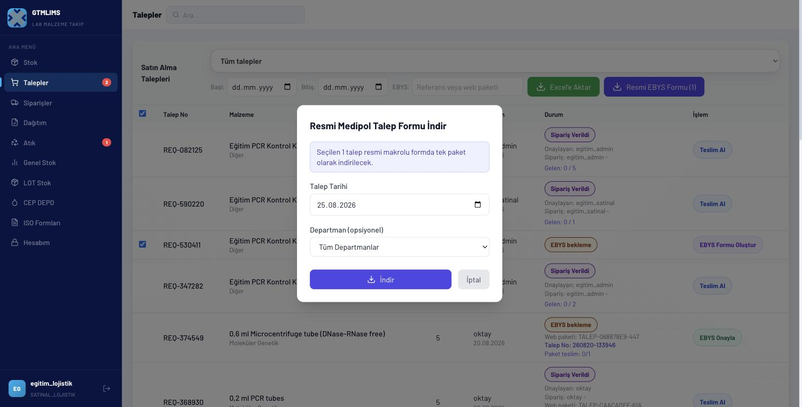

### Sahne 4 — EBYS paket onayı (04:00-05:40)

- **Tıklama/veri:** Dış EBYS Onayı Geldi görevi > paket satırı > Dış EBYS Onayı Geldi; kayıtlı Talep No'yu kontrol et; tedarikçi `Eğitim Medikal A.Ş.`, PO `EGT-PO-0001`; Onay Geldi, Siparişe Al.
- **Vurgu:** Paketteki bütün kalemlerin birlikte siparişe geçmesi.
- **Ekran yazısı:** `Paket onayı tüm kalemleri etkiler`
- **Seslendirme:** “Dış onay tamamlandığında Dış EBYS Onayı Geldi görevini açıyoruz. Tek pencerede kayıtlı resmi Talep No’yu ve birlikte etkilenecek kalem sayısını kontrol ediyoruz. Tedarikçi ve PO numarası varsa ekleyip Onay Geldi, Siparişe Al diyoruz. Tarayıcıda ayrı ayrı soru pencereleri açılmaz.”

### Sahne 5 — Siparişler sayfası (05:40-06:50)

- **Tıklama:** Siparişler; başlangıç/bitiş ve EBYS filtresi; ilgili satırı bul.
- **Vurgu:** Sipariş, gelen ve kalan miktar.
- **Ekran yazısı:** `Gelen + kalan miktarı izleyin`
- **Seslendirme:** “Şimdi Siparişler sayfasına geçiyoruz. İlgili kaydı EBYS referansıyla buluyoruz. Satırda sipariş edilen toplam, daha önce gelen miktar ve kalan miktar birlikte gösterilir. Fiziksel mal kabulüne başlamadan önce irsaliye ve ürün üzerindeki miktarın bu kayıtla uyumlu olduğunu kontrol ediyoruz.”

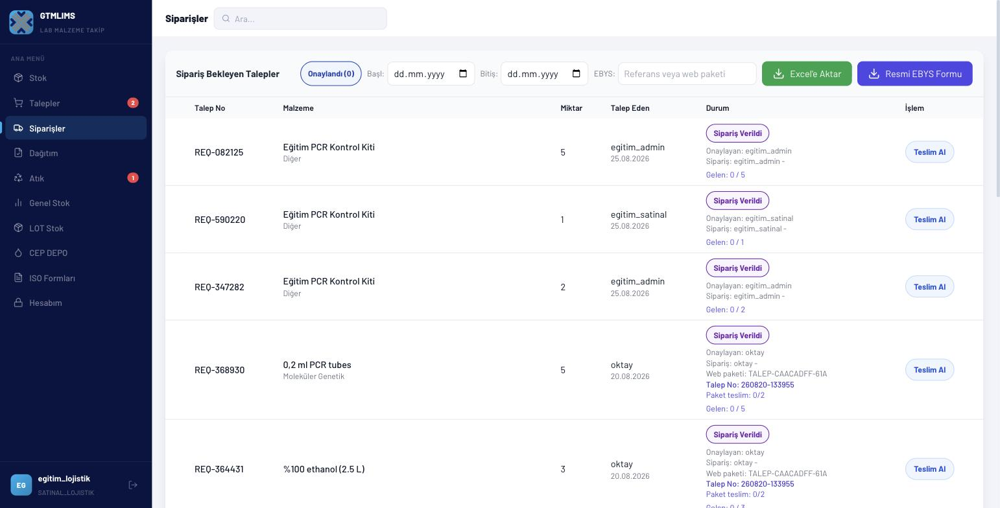

### Sahne 6 — İlk kısmi teslim (06:50-09:30)

- **Tıklama/veri:** Teslim Al; gelen `3`, teslim alan `egitim_lojistik`, LOT `EGT-LOT-A`, SKT `25.08.2027`, fatura `EGT-FTR-0001`, tedarikçi, fiyat `1250`, güvenli örnek PDF/resim; Teslim Al.
- **Vurgu:** LOT zorunluluğu, 4 MB ve dosya türü sınırı, kısmi durum.
- **Ekran yazısı:** `Kısmi teslim: her parti ayrı kaydedilir`
- **Seslendirme:** “Teslim Al’a tıklıyoruz. Beş kutuluk siparişin ilk üç kutusu geldiği için Gelen Miktar alanına üç yazıyoruz. Teslim alan kişiyi, kutunun üzerindeki LOT numarasını ve SKT’yi giriyoruz. Fatura, tedarikçi ve birim fiyat bilgilerini ekliyoruz. Belge alanı yalnız PDF veya izin verilen resimleri, en fazla dört megabayt kabul eder. Kaydettiğimizde talep kısmi teslim durumunda kalır ve üç kutu yeni LOT olarak stoğa eklenir.”

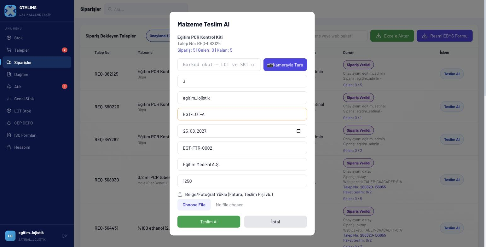

### Sahne 7 — İkinci teslim ve tamamlanma (09:30-11:00)

- **Tıklama/veri:** Aynı sipariş > Teslim Al; gelen `2`, LOT `EGT-LOT-B`, farklı SKT `25.02.2028`; kaydet.
- **Vurgu:** Farklı LOT/SKT'nin ayrı kaydı ve toplamın tamamlanması.
- **Ekran yazısı:** `Farklı LOT'u ayrı teslim edin`
- **Seslendirme:** “Kalan iki kutu farklı bir partiyle geldiğinde aynı siparişi yeniden açıyoruz. Bu kez EGT-LOT-B ve yeni SKT’yi giriyoruz. İki partiyi tek LOT altında birleştirmiyoruz. İkinci teslimden sonra gelen toplam sipariş miktarına ulaşır; kayıt tamamlanır ve her iki LOT stokta ayrı ayrı izlenir.”

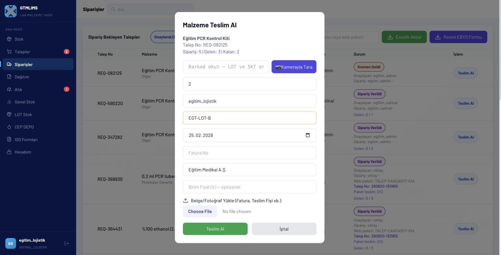

### Sahne 8 — LOT kontrolü ve SKT düzeltme (11:00-12:30)

- **Tıklama:** LOT Stok > LOT'lar; ürün ara; iki LOT'u göster. Yetkili örnek satır > Düzenle; mevcut/yeni SKT; İptal.
- **Vurgu:** SKT düzeltmenin yalnız belge doğrulamasıyla yapılması.
- **Ekran yazısı:** `SKT düzeltmesi belgeye dayanır`
- **Seslendirme:** “LOT Stok sayfasındaki LOT’lar görünümünde iki parti ayrı satırdadır. Arama ve bölüm filtresiyle ürünü buluyoruz. SKT yanlış girildiyse Düzenle kullanılabilir; ancak bu değişiklik yalnız üretici etiketi veya teslim belgesi doğrulandıktan sonra yapılmalıdır. Örnekte değiştirmeden İptal ediyoruz.”

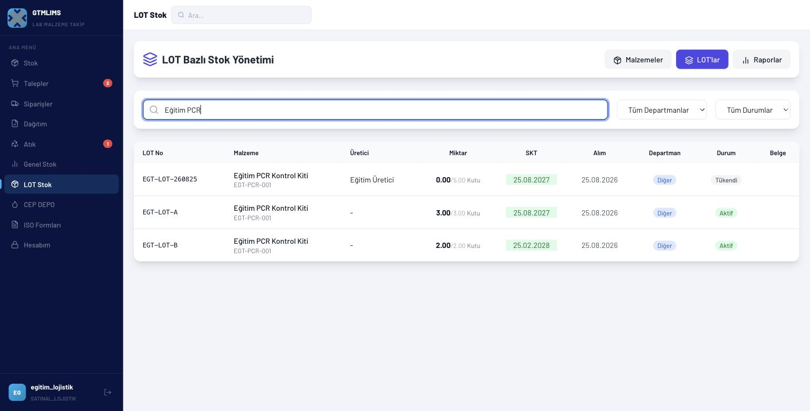

### Sahne 9 — CEP DEPO dağıtımı (12:30-14:30)

- **Tıklama:** Dağıtım > bekleyen teknisyen talebi; miktar `2`; LOT A/B seçimi; toplamı eşleştir; Onayla & Dağıt.
- **Vurgu:** Bölüm/teknisyen, parti toplamı ve fiziksel kutu eşleştirme.
- **Ekran yazısı:** `Dağıtımda fiziksel parti esastır`
- **Seslendirme:** “Dağıtım sayfasında bekleyen lab teknisyeni talebini seçiyoruz. Verilecek miktarı iki olarak doğruluyor ve elimizdeki fiziksel kutunun LOT’unu seçiyoruz. Birden fazla partiden verilecekse Parti Ekle ile satır açılır; satırların toplamı talep miktarıyla aynı olmalıdır. Onayla ve Dağıt işlemi ana depodan düşer, hedef bölüm CEP DEPOsuna ekler ve talebi tamamlar.”

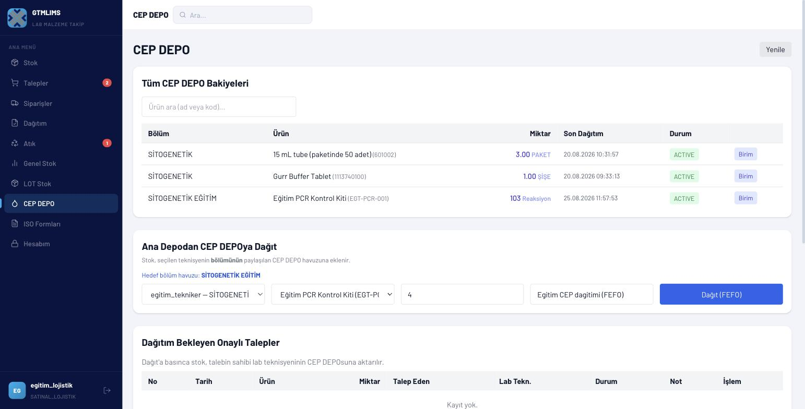

### Sahne 10 — Genel dağıtım ve atık (14:30-15:40)

- **Tıklama:** Stok > Dağıt formu; bölüm, alan kişi, amaç; İptal. Atık formunu ve Atık listesini göster.
- **Vurgu:** Talep seçmeden yapılan genel dağıtım ile CEP talebi arasındaki fark.
- **Ekran yazısı:** `Talepli veya genel dağıtımı ayırın`
- **Seslendirme:** “Stok satırındaki Dağıt düğmesi genel dağıtım için de kullanılabilir. Bekleyen CEP talebi varsa önce doğru talep seçilir; talepsiz işlemde bölüm, alan kişi ve kullanım amacı elle girilir. Hasarlı veya miadı dolmuş malzeme dağıtılmaz; doğru LOT üzerinden Atık kaydı açılır.”

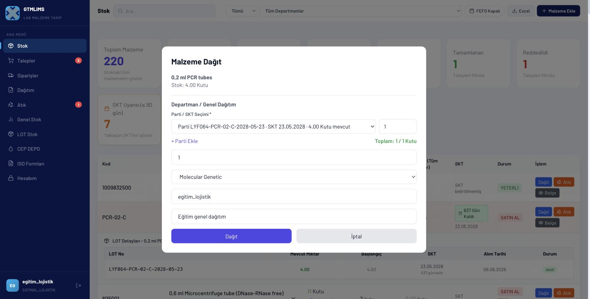

### Sahne 11 — ISO formları ve kapanış (15:40-18:00)

- **Tıklama:** ISO Formları > LY-F064 bölüm `SİTOGENETİK EĞİTİM` > İndir; MG-F069 bölüm ve yıl `2026` > İndir. Genel Stok > Yenile; çıkış.
- **Vurgu:** Kontrollü form kapsamı ve dosya adı.
- **Ekran yazısı:** `LY-F064 sayım · MG-F069 süreç takibi`
- **Seslendirme:** “ISO Formları sayfasında LY-F064 için bölüm seçerek güncel malzeme sayım formunu indiriyoruz. MG-F069 için bölüm ve yılı seçiyoruz; tüm bölümler seçeneği her bölümü ayrı sayfada üretir. Genel Stok’ta teslim ve dağıtım sonucunu kontrol ettikten sonra çıkış yapıyoruz. Lojistik sürecinin başarısı, fiziksel ürün ile sistemdeki LOT, miktar ve belgenin birebir eşleşmesine bağlıdır.”

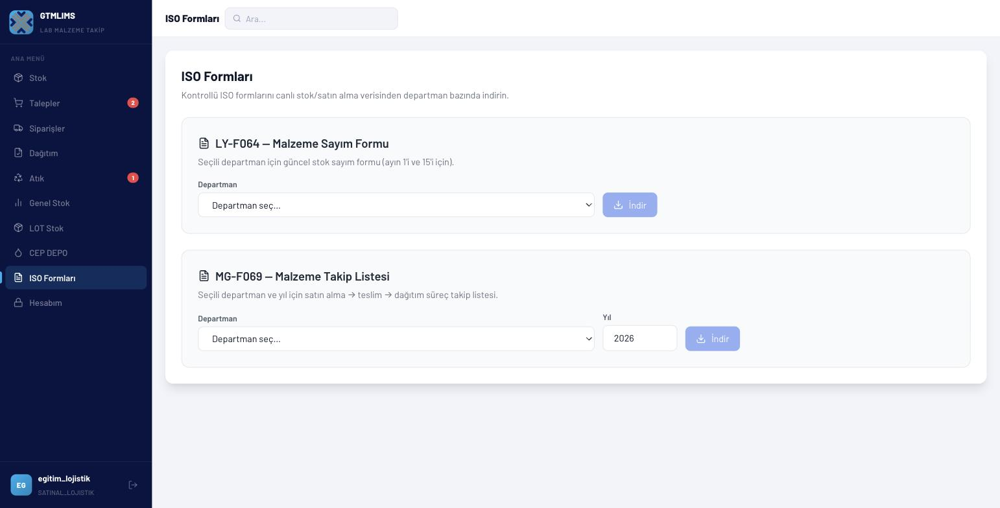

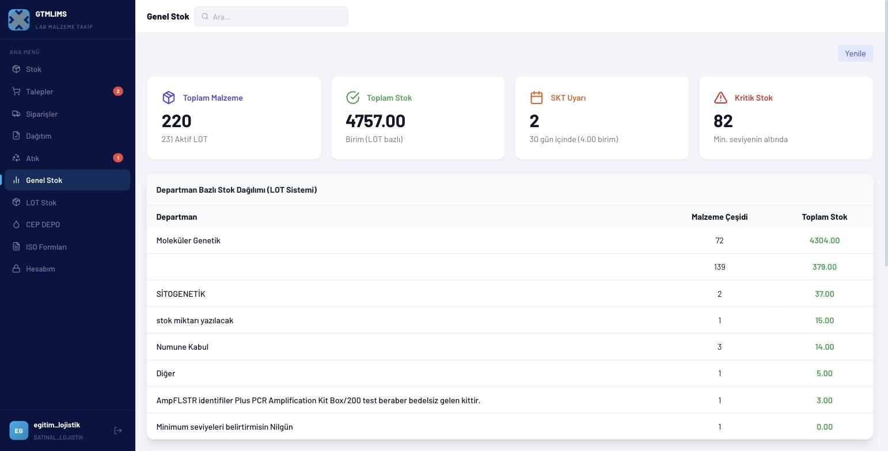

## Dikkat noktaları ve hatalar

- Standart Onayla/Reddet düğmeleri lojistik rolünde görünmez; iş gerekçesi kararını SATINAL/ADMIN verir.
- EBYS formunu indirmek sipariş onayı değildir; dış EBYS onayı tamamlanmadan Dış EBYS Onayı Geldi işlemi yapılmaz.
- Paket onayı paketteki tüm kalemleri etkiler.
- Kısmi teslimde yalnız fiilen gelen miktar yazılır.
- Farklı LOT veya SKT tek teslim kaydında birleştirilmez.
- Fiziksel etiketle eşleşmeyen LOT'tan dağıtım yapılmaz.
- Mevcut hesapta Fiyatlar menüsü yoktur; teslim formundaki fiyat kaydı yine saklanabilir, fakat fiyat raporu ek yetki gerektirir.
- Barkod ekranları kapalı olduğundan eğitimde kullanılmaz.

## Kapanış metni

“EBYS paketini doğruladık, siparişe aldık, kısmi ve tam teslimleri ayrı LOT’larla kaydettik, doğru partiyi CEP DEPOya dağıttık ve ISO formlarını indirdik. Her mal kabulünde miktar, LOT, SKT ve belgeyi fiziksel ürün üzerinden doğrulamayı unutmayın.”
