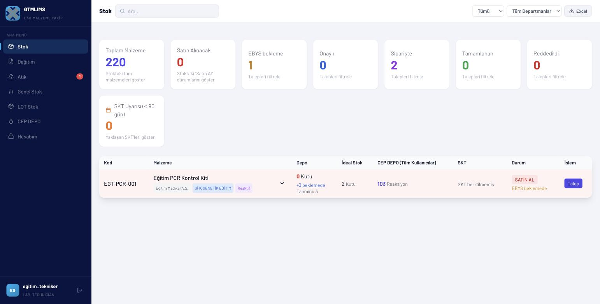
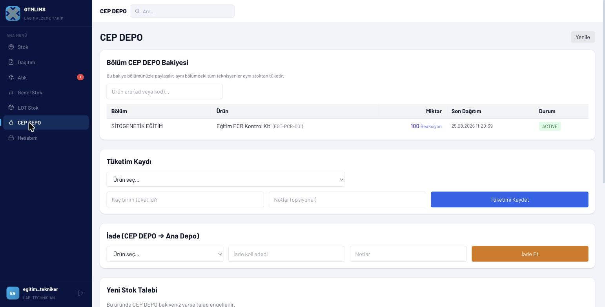
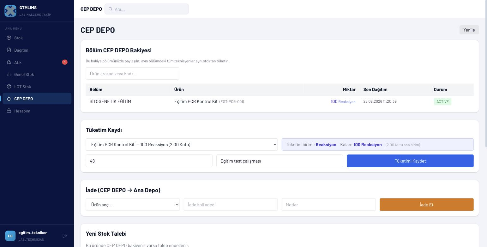
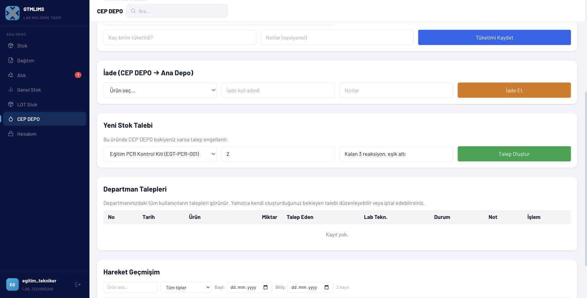
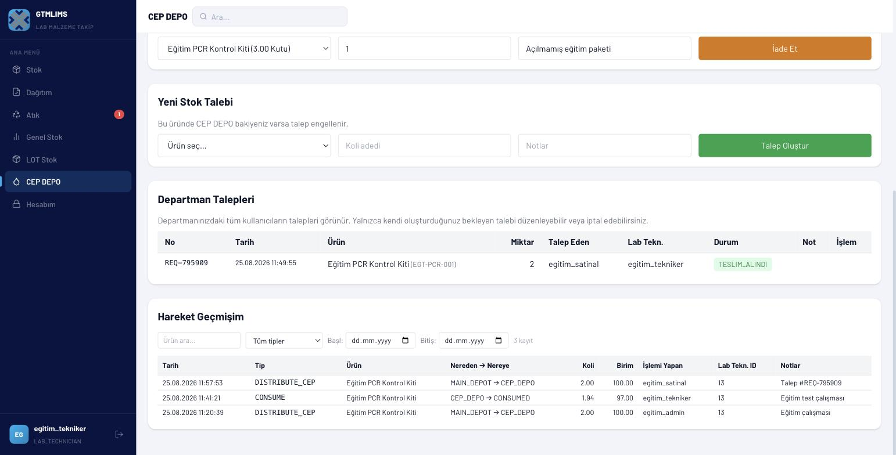
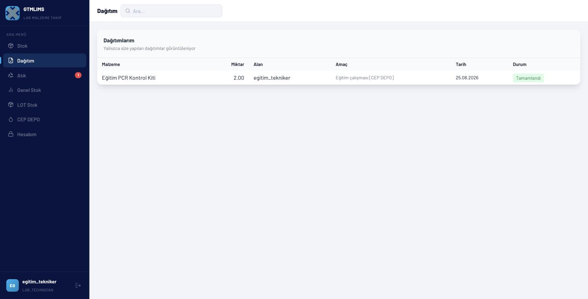
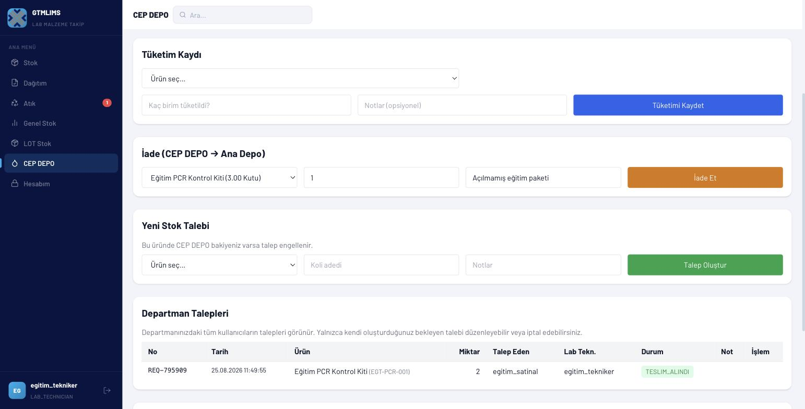
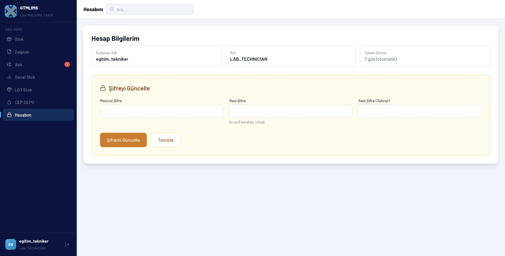

# LAB_TECHNICIAN eğitim videosu

## Video kimliği

- **Başlık:** GTMLIMS Lab Teknisyeni Eğitimi — CEP DEPO, Tüketim, İade ve Talep
- **Hedef kitle:** Laboratuvar teknisyenleri ve bölüm CEP DEPO kullanıcıları
- **Amaç:** Bölüm stoğunu görmek, tüketim/iade kaydetmek, stok kuralına uygun talep açmak ve kendi dağıtımlarını izlemek
- **Tahmini süre:** 12-13 dakika
- **Doğrulama:** LAB_TECHNICIAN hesabı canlı doğrulandı; hesap “Diğer” ve “SİTOGENETİK” bölümlerine bağlıdır.

## Görev ve sorumluluklar

- Yalnız atanmış bölümlere açık/global malzemeleri ve bölüm CEP bakiyesini izlemek
- Her gerçek tüketimi doğru PACK, UNIT veya TEST birimiyle kaydetmek
- Kullanılmayan tam paketleri ana depoya iade etmek
- Normal üründe CEP stoğu sıfırlandığında; reaksiyon ürününde eşik altına inildiğinde talep açmak
- Kendi oluşturduğu bekleyen CEP talebinin miktarını düzenlemek veya talebi iptal etmek
- Kendisine yapılan dağıtımları kontrol etmek
- Ana depo malzemesi/LOT'u, satın alma onayını, dağıtımı veya atığı değiştirmemek

## Gösterilecek sayfalar

Ürünleri Gör, Dağıtımlarım, Genel Stok, Günlük İşlerim ve Hesabım. Günlük İşlerim açılış ekranıdır; Tüketim Kaydet, Malzeme İste, İade Et ve Geçmişi Gör seçeneklerinden yalnız seçilen işlem ekranda görünür. Yetkisiz Atık ve LOT Stok menüleri gösterilmez.

## Örnek senaryo

Teknisyen SİTOGENETİK bölümündeki `EGT-PCR-001` ürününün 50 reaksiyonluk CEP bakiyesini görür. 48 test tüketir; kalan iki reaksiyon eşik olan üçün altına düştüğü için iki kutuluk talep açar. Bekleyen talebi önce üçe düzenler, sonra tekrar ikiye çevirir. Talep dağıtıldıktan sonra yeni bakiyeyi ve kendisine yapılan dağıtımı kontrol eder; kullanılmayan bir tam paketi iade eder.

## Sahne planı ve seslendirme

### Sahne 1 — Giriş ve bölüm kapsamı (00:00-01:10)

- **Tıklama:** Eğitim teknisyen hesabıyla giriş; kullanıcı kartı; Stok.
- **Vurgu:** Rol ve atandığı bölümlere göre görünen stok.
- **Ekran yazısı:** `LAB_TECHNICIAN — Bölüm CEP DEPO sahibi`
- **Seslendirme:** “Lab teknisyeni hesabıyla giriş yapıyoruz. Bu rol ana deponun yöneticisi değildir; kendi bölümünün cep stoğunu kullanır ve tüketimini kaydeder. Stok ekranında atandığımız bölümlere açık veya genel malzemeler görünür. Göremediğimiz bir ürün için yöneticiden bölüm üyeliği ve malzeme kapsamını kontrol etmesini isteriz.”

### Sahne 2 — Stok ekranını okuma (01:10-02:20)

- **Tıklama:** Arama `EGT-PCR-001`; satırı genişlet.
- **Vurgu:** Ana depo ile CEP DEPO sütununun farkı, SKT ve durum.
- **Ekran yazısı:** `Ana depo stoğu ve CEP stoğu farklıdır`
- **Seslendirme:** “Arama alanına eğitim ürününün kodunu yazıyoruz. Ana depo stoğu, depoda bulunan fiziksel paketleri; CEP DEPO sütunu ise bölüme teslim edilmiş kullanım bakiyesini gösterir. Bu iki sayıyı birbirinin yerine kullanmıyoruz. Satırı genişlettiğimizde ana depodaki LOT bilgilerini yalnız referans amacıyla görebiliriz.”

### Sahne 3 — CEP DEPO bakiyesi (02:20-03:30)

- **Tıklama:** Sol menü > CEP DEPO > Benim; ürün arama.
- **Vurgu:** Bölüm, paket ve alt birim, son dağıtım, durum.
- **Ekran yazısı:** `Bölüm bakiyesini işlem öncesi kontrol et`
- **Seslendirme:** “Asıl çalışma alanımız CEP DEPO’dur. Benim görünümünde ürün adını veya kodunu arıyoruz. Bakiye paket ve varsa alt birimle birlikte gösterilir. Son dağıtım tarihi ve aktif ya da sıfır durumu, kaydın güncelliğini anlamamıza yardımcı olur.”

### Sahne 4 — Tüketim kaydı (03:30-05:20)

- **Tıklama/veri:** Tüketim Kaydı > ürün; sistemin tanımladığı tüketim tipi TEST; miktar `48`; not `Eğitim test çalışması`; Tüketimi Kaydet.
- **Vurgu:** Birim türü, mevcut bakiyeden fazla tüketememe.
- **Ekran yazısı:** `Gerçek tüketimi aynı gün kaydedin`
- **Seslendirme:** “Tüketim Kaydı bölümünde ürünü seçiyoruz. Malzeme TEST tipiyle tanımlandığı için miktarı reaksiyon veya test sayısı olarak giriyoruz. Bu örnekte kırk sekiz test tüketildiğini ve eğitim çalışması notunu yazıyoruz. Tüketimi Kaydet’e bastığımızda bölüm bakiyesi otomatik azalır. Sistem mevcut bakiyeden fazla miktarı kabul etmez; hata alırsak fiziksel sayımı ve birim tanımını kontrol ederiz.”

### Sahne 5 — Talep açma kuralı (05:20-06:50)

- **Tıklama/veri:** Yeni Stok Talebi > ürün; koli `2`; not `Kalan 2 reaksiyon, eşik altı`; Talep Oluştur.
- **Vurgu:** Normal ürün/sıfır kuralı ve reaksiyon/eşik kuralı.
- **Ekran yazısı:** `Talep ancak stok kuralı izin verirse açılır`
- **Seslendirme:** “Tüketimden sonra iki reaksiyon kaldı. Bu malzemenin talep eşiği üç olduğu için yeni stok talebi açabiliriz. Ürünü seçiyor, iki kutu yazıyor ve kısa açıklamayı ekliyoruz. Normal paket ürünlerinde herhangi bir bakiye varken talep engellenir; önce mevcut stok tüketilmeli veya iade edilmelidir.”

### Sahne 6 — Bekleyen talebi düzenleme (06:50-08:10)

- **Tıklama:** Departman Talepleri > kendi `TALEP_EDILDI` satırı > Düzenle; miktar `3`; Kaydet. Tekrar `2` yapıp kaydet. İptal düğmesini göster, tıklama.
- **Vurgu:** Yalnız talebi oluşturan kişi ve yalnız bekleyen durum.
- **Ekran yazısı:** `Bekleyen kendi talebini düzenleyebilirsin`
- **Seslendirme:** “Departman Talepleri tablosunda talep numaramızı ve durumumuzu görüyoruz. Talep hâlâ bekliyorsa ve kaydı biz oluşturduysak miktarı Düzenle ile değiştirebiliriz. Miktar pozitif tam sayı olmalıdır. İptal düğmesi de yalnız aynı koşullarda çalışır. Talep onaylandıktan veya dağıtıldıktan sonra bu iki işlem kapanır.”

### Sahne 7 — Onay ve görev devri (08:10-09:00)

- **Tıklama:** Talep durumunu göster; başka rol videosuna geçiş kartı.
- **Vurgu:** Teknisyenin kendi talebini onaylamaması.
- **Ekran yazısı:** `Talep → SATINAL onayı → Lojistik dağıtım`
- **Seslendirme:** “Talebi oluşturduktan sonra teknisyenin görevi beklemektir. Onay veya red kararını SATINAL ya da yönetici verir. Uygun talep ana depodan doğru LOT seçilerek lojistik veya yetkili depo personeli tarafından CEP DEPOya dağıtılır. Kendi talebimizi kendimiz onaylamayız.”

### Sahne 8 — Dağıtım ve yeni bakiye (09:00-10:10)

- **Tıklama:** Dağıtım > Dağıtımlarım; yeni kayıt. CEP DEPO > Yenile; bakiyeyi göster.
- **Vurgu:** Malzeme, miktar, dağıtan, tarih, durum.
- **Ekran yazısı:** `Teslim edilen miktarı fiziksel olarak doğrula`
- **Seslendirme:** “Dağıtım tamamlandığında Dağıtım sayfasında yalnız bize yapılan kayıtları görüyoruz. Malzeme, miktar, dağıtan kişi ve tarihi fiziksel teslimle karşılaştırıyoruz. Mevcut ayarda iki adımlı teslim onayı kapalı olduğu için ayrıca Teslim Aldım düğmesi yoktur. CEP DEPOya dönüp Yenile’ye bastığımızda yeni bölüm bakiyesi görünür.”

### Sahne 9 — İade (10:10-11:30)

- **Tıklama/veri:** İade > ürün; paket `1`; not `Açılmamış eğitim paketi`; İade Et.
- **Vurgu:** Yalnız tam paket, stok yetersizse hata.
- **Ekran yazısı:** `Kullanılmamış tam paketi ana depoya iade et`
- **Seslendirme:** “Kullanılmamış ve fiziksel olarak ana depoya geri verilen tam paketleri İade bölümünden kaydediyoruz. Ürünü seçip bir paket ve açıklamayı giriyoruz. İade Et işlemi bölüm bakiyesini azaltır ve ana depodaki uygun LOT’u artırır. Fiziksel teslim gerçekleşmeden sistemde iade kaydı açmıyoruz.”

### Sahne 10 — Hareket geçmişi, hesap ve kapanış (11:30-13:00)

- **Tıklama:** Hareket Geçmişim; tarih/tip/ürün filtreleri; Hesabım > şifre formu; çıkış.
- **Vurgu:** Dağıtım, tüketim, iade ve talep hareketleri.
- **Ekran yazısı:** `Hareket geçmişi bölüm defteridir`
- **Seslendirme:** “Hareket geçmişi, bölüm stok defterinin özetidir. Ürün, işlem tipi ve tarih filtresiyle dağıtım, tüketim ve iade kayıtlarını bulabiliriz. Hesabım sayfasından en az sekiz karakterli yeni şifre belirleyebiliriz. İşimiz bittiğinde çıkış yapıyoruz. CEP DEPO’nun doğru görünmesi, her gerçek tüketim ve iadenin zamanında kaydedilmesine bağlıdır.”

## Dikkat noktaları ve hatalar

- Ana depo miktarını kendi kullanılabilir bakiyeniz sanmayın.
- Tüketim tipini PACK/UNIT/TEST olarak malzeme tanımına uygun seçin.
- Fiziksel tüketim olmadan test amaçlı kayıt girmeyin; eğitim veritabanı kullanın.
- Normal üründe bakiye varken yeni talep açılamaz; reaksiyon ürünü eşik kuralını kontrol edin.
- Başka teknisyenin veya sizin adınıza başkası tarafından açılmış talebi düzenleyemezsiniz.
- Onaylanmış talep düzenlenemez veya iptal edilemez.
- Günlük İşlerim ekranında yalnız yapacağınız işi seçin; diğer formlar aynı anda ekranda yer kaplamaz.
- Atık ve LOT işlemleri yetkili depo rollerinin görevidir ve teknisyen menüsünde gösterilmez.

## Kapanış metni

“Bölüm CEP DEPO bakiyemizi kontrol ettik, gerçek tüketimi kaydettik, eşik kuralına uygun talep açtık, kendi bekleyen talebimizi yönettik, dağıtımı doğruladık ve kullanılmayan paketi iade ettik. Doğru bölüm stoğu için her tüketimi ve iadeyi zamanında kaydetmeyi unutmayın.”
