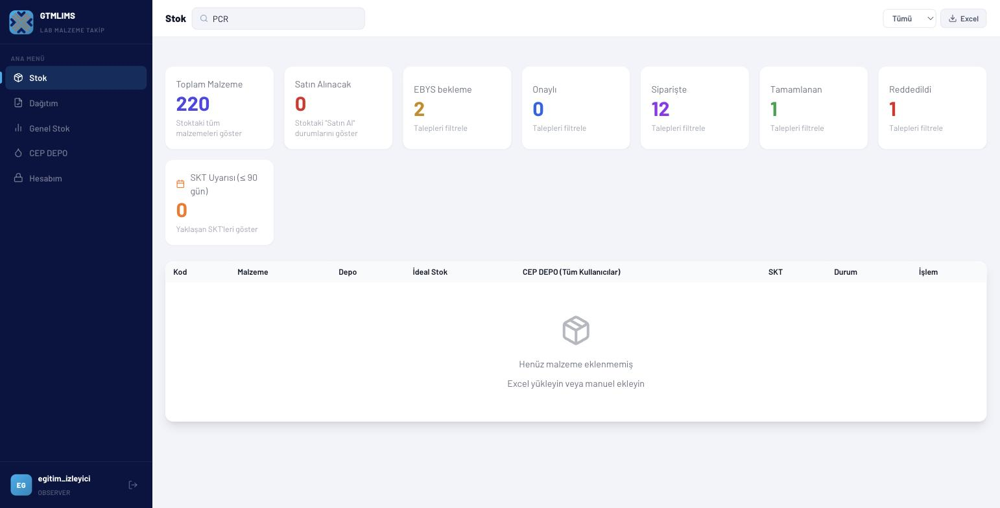
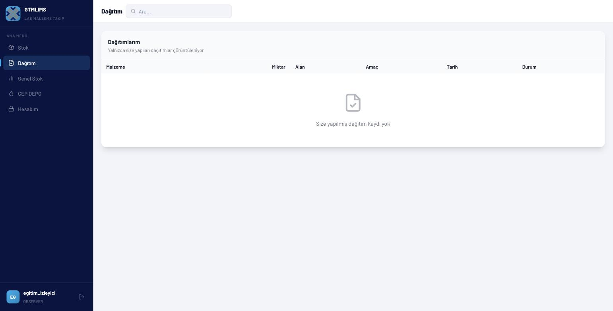
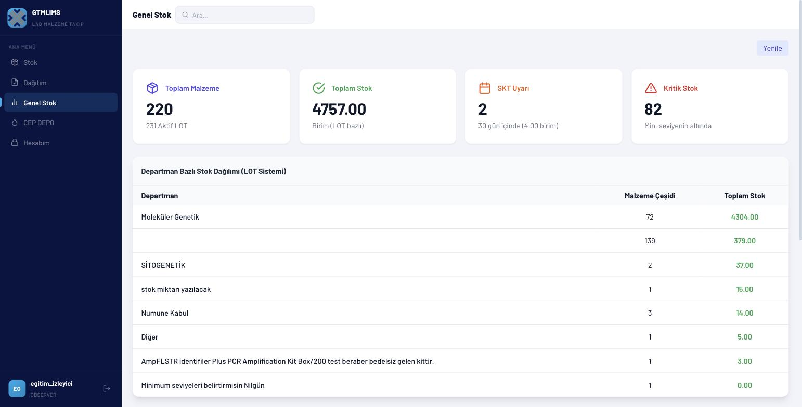
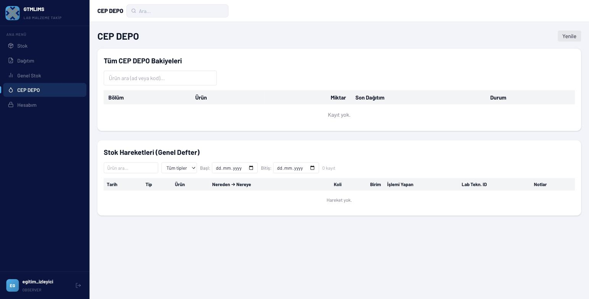
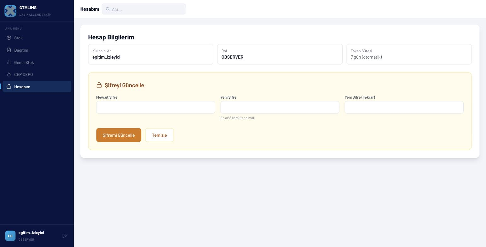

# OBSERVER eğitim videosu

## Video kimliği

- **Başlık:** GTMLIMS Observer Eğitimi — Güvenli Görüntüleme ve Rapor Takibi
- **Hedef kitle:** Yalnız görüntüleme yetkisi bulunan yöneticiler, denetim katılımcıları ve paydaşlar
- **Amaç:** Veriyi değiştirmeden stok, kişisel dağıtım, genel stok ve CEP hareketlerini incelemek; Excel çıktısı ve hesap işlemlerini göstermek
- **Tahmini süre:** 6-7 dakika
- **Doğrulama:** OBSERVER hesabı canlı doğrulandı; kullanıcı yönetimi, fiyat ve ISO API'leri yetkisizdir.

## Görev ve sorumluluklar

- Görünür stok ve raporları incelemek
- Arama, durum ve bölüm filtrelerini doğru kullanmak
- Yetkili Excel çıktısını almak
- Yalnız kendisine yapılan dağıtımları görmek
- CEP DEPO bakiyeleri/hareketlerini salt-okunur incelemek
- Hiçbir stok, talep, kullanıcı veya sistem ayarını değiştirmemek

## Gösterilecek sayfalar

Stok, Dağıtım, Genel Stok, CEP DEPO ve Hesabım. Talepler, Siparişler, Atık, LOT Stok, Fiyatlar, ISO Formları ve Kullanıcılar menüde yoktur.

## Örnek senaryo

Observer, `EGT-PCR-001` ürününü arar; stok, hedef ve SKT'yi inceler, listeyi Excel'e aktarır. Dağıtımlarım'da kendisine yapılan bir teslimatı kontrol eder, Genel Stok göstergelerini ve CEP hareketlerini filtreler, ardından çıkış yapar.

## Sahne planı ve seslendirme

### Sahne 1 — Giriş ve salt-okunur kapsam (00:00-00:50)

- **Tıklama:** Observer eğitim hesabıyla giriş; sol menüyü göster.
- **Ekran yazısı:** `OBSERVER — Yalnız görüntüleme`
- **Seslendirme:** “OBSERVER hesabıyla giriş yapıyoruz. Sol menüde yalnız görüntüleme görevimize uygun sayfalar bulunur. Bu rol stok, talep, dağıtım veya kullanıcı verisini değiştirmez. Bir işlem düğmesi beklemek yerine arama, filtre ve raporlama araçlarını kullanırız.”

### Sahne 2 — Stok arama ve filtreleme (00:50-02:20)

- **Tıklama:** Stok; arama `EGT-PCR-001`; Tümü/Stokta/Satın Al; bölüm filtresi; satırı genişlet.
- **Vurgu:** Kod, malzeme, ana depo, CEP toplamı, SKT, durum.
- **Ekran yazısı:** `Arama + durum + bölüm`
- **Seslendirme:** “Stok sayfasında ürün kodunu veya adını arayabiliriz. Durum filtresi yeterli ve satın alınması gereken kayıtları ayırır; bölüm filtresi görünür kapsamı daraltır. Satırı açtığımızda LOT numarası, miktar ve SKT ayrıntılarını görüyoruz. Observer hesabında Talep, Dağıt, Atık veya Düzenle düğmeleri bulunmaz.”

> **Canlı doğrulama notu:** Eğitim OBSERVER hesabıyla test edilirken Stok tablosu, arama terimi olsun/olmasın ve bölüm atanmış olsun/olmasın boş kalıyor (`Henüz malzeme eklenmemiş`) — üst kartlardaki "Toplam Malzeme: 220" ile tablodaki sıfır sonuç arasında bir tutarsızlık var. Bu videoya başlamadan önce ilgili API/departman kapsamı sorunu doğrulanmalı veya sahne, sorunsuz çalışan bir hesapla yeniden çekilmelidir.

### Sahne 3 — Excel ve SKT yorumu (02:20-03:10)

- **Tıklama:** Excel; üst SKT uyarısı varsa göster ama açmadan anlat.
- **Vurgu:** İndirilen verinin paylaşım güvenliği; LOT raporu sınırı.
- **Ekran yazısı:** `Dışa aktarılan dosya da kurumsal veridir`
- **Seslendirme:** “Excel düğmesi görünür stok listesini raporlamak için kullanılır. İndirilen dosya kurumsal veri içerdiği için yalnız yetkili ortamda saklanmalıdır. Üst SKT sayacı tek başına kesin denetim kaynağı değildir; ayrıntılı LOT ve ISO kontrollerini ilgili yetkili rollerden istemeliyiz.”

### Sahne 4 — Dağıtımlarım (03:10-04:10)

- **Tıklama:** Dağıtım; tabloyu göster.
- **Vurgu:** Observer'ın yalnız `receivedBy` alanı kendi kullanıcı adı olan kayıtları görmesi.
- **Ekran yazısı:** `Yalnız size yapılan dağıtımlar`
- **Seslendirme:** “Dağıtım sayfası Observer için kişisel kapsamda çalışır. Burada yalnız kullanıcı adımıza yapılan dağıtımları; malzeme, miktar, alan kişi, amaç, tarih ve durum bilgileriyle görürüz. Tüm kurum dağıtımlarını dışa aktarma veya tamamlanma durumunu değiştirme yetkimiz yoktur.”

### Sahne 5 — Genel Stok (04:10-05:10)

- **Tıklama:** Genel Stok > Yenile; özet kartları, bölüm tablosu ve son aktiviteler.
- **Vurgu:** Raporun görüntüleme amacı.
- **Ekran yazısı:** `Genel görünüm, işlem ekranı değildir`
- **Seslendirme:** “Genel Stok sayfasında Yenile’ye tıklayarak toplam malzeme, LOT bazlı stok, SKT uyarısı ve kritik stok kartlarını güncelliyoruz. Bölüm dağılımı ve son aktiviteler operasyonun genel durumunu gösterir. Buradaki bilgiler izleme içindir; düzeltme gerektiğinde kayıt sahibine veya yöneticiye bildirilir.”

### Sahne 6 — CEP DEPO ve hareketler (05:10-06:10)

- **Tıklama:** CEP DEPO; bakiye arama; hareketlerde ürün, tip ve tarih filtreleri; Temizle.
- **Vurgu:** Salt-okunur tablo, işlem formu bulunmaması.
- **Ekran yazısı:** `CEP hareketlerini filtreleyin`
- **Seslendirme:** “CEP DEPO sayfasında görünür bakiyeleri ve hareket defterini salt-okunur olarak inceliyoruz. Ürün araması, işlem tipi ve tarih aralığıyla ilgili kaydı bulabiliriz. Dağıt, tüket, iade veya talep onay düğmeleri Observer rolünde kullanılmaz.”

### Sahne 7 — Hesap ve kapanış (06:10-07:00)

- **Tıklama:** Hesabım; şifre alanları; çıkış.
- **Vurgu:** En az sekiz karakter ve güvenli çıkış.
- **Ekran yazısı:** `Görüntüle, raporla, değiştirme`
- **Seslendirme:** “Hesabım sayfası kullanıcı adımızı ve rolümüzü gösterir. Mevcut şifreyi doğrulayarak en az sekiz karakterli yeni şifre belirleyebiliriz. İncelememiz bittiğinde sol alttaki çıkış simgesini kullanıyoruz. Observer rolünün özeti şudur: veriyi ara, filtrele ve raporla; operasyon kaydını değiştirme.”

## Dikkat noktaları ve hatalar

- Görünmeyen menüyü doğrudan URL veya API ile açmaya çalışmayın.
- Excel dosyasını kişisel e-posta veya yetkisiz bulut alanına yüklemeyin.
- Dağıtım ekranının kurumun tüm dağıtımları olduğunu varsaymayın; kişisel kapsamdır.
- Stok farkını kendiniz düzeltmeyin; ekran görüntüsü/talep numarasıyla yetkili role bildirin.
- Observer'ın API düzeyinde bazı genel GET uçlarına erişmesi, gizli menülerin eğitim kapsamına girdiği anlamına gelmez.
- Canlı doğrulamada OBSERVER hesabıyla Stok tablosu her koşulda boş döndü (bkz. Sahne 2 notu); videodan önce düzeltilmeli veya farklı bir hesapla doğrulanmalıdır.

## Kapanış metni

“Observer rolüyle stokları filtreledik, güvenli Excel çıktısını aldık, kişisel dağıtımlarımızı ve genel stok göstergelerini inceledik. Bu rolün temel ilkesi, veriyi değiştirmeden doğru bilgiyi bulmak ve gerektiğinde yetkili ekibe açık bir referansla bildirmektir.”

