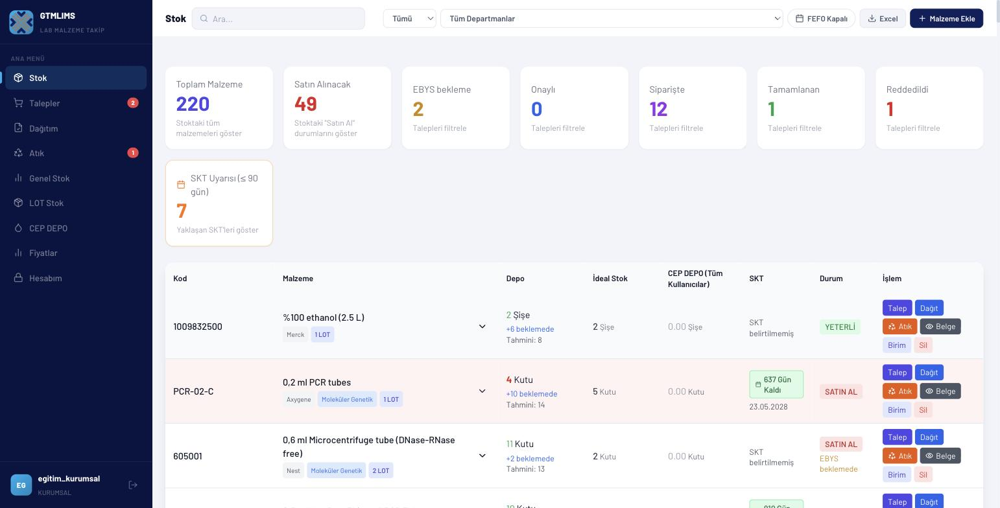
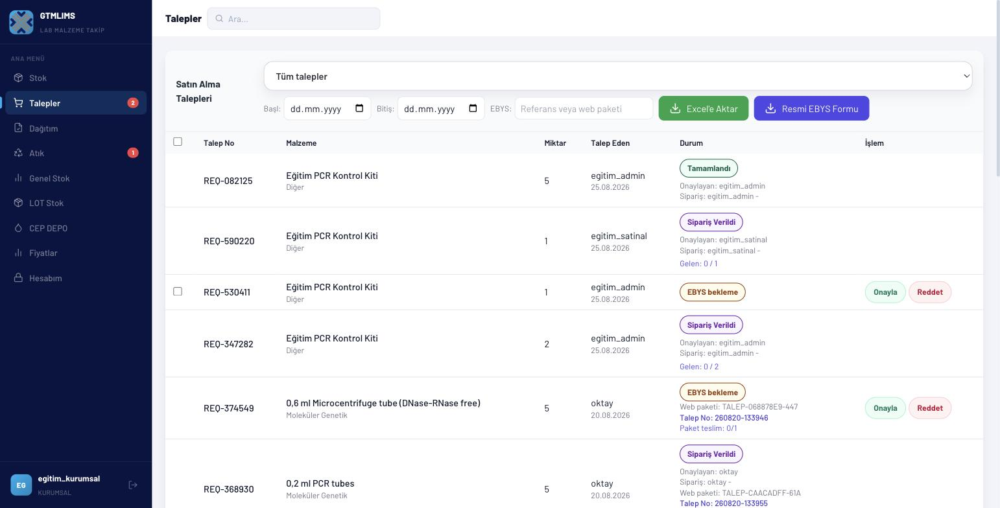
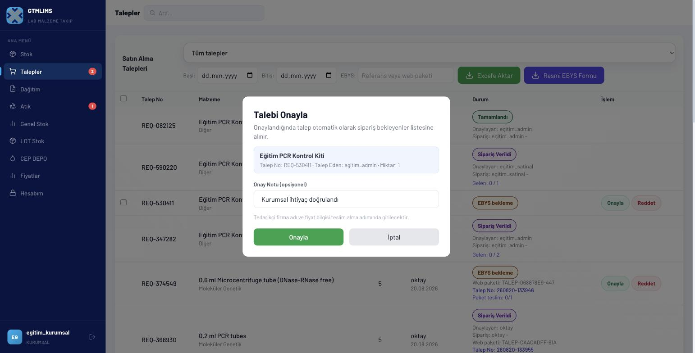
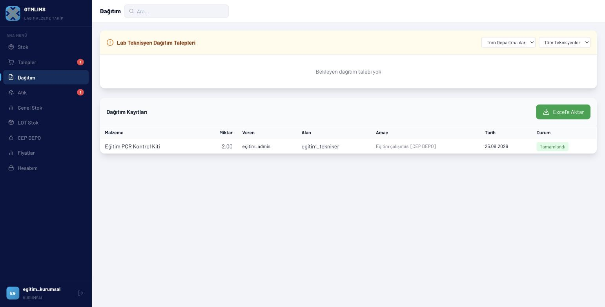
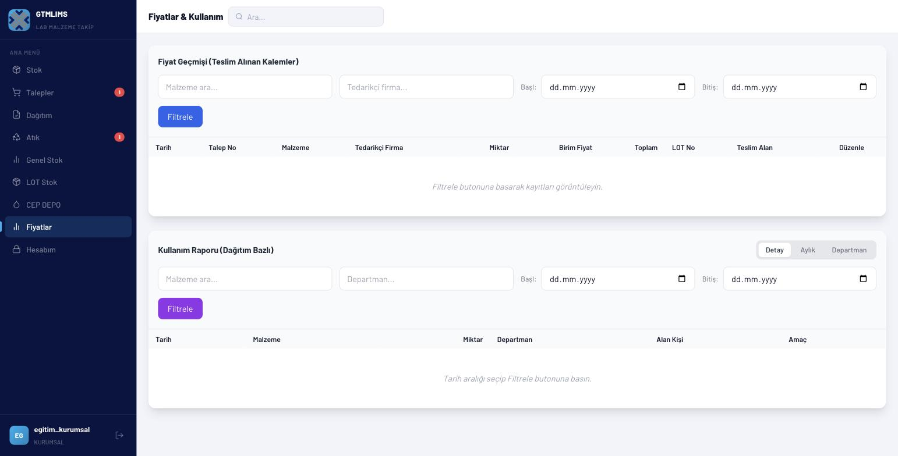
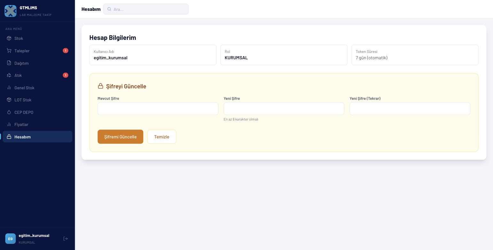

# KURUMSAL eğitim videosu

## Video kimliği

- **Başlık:** GTMLIMS Kurumsal Kullanıcı Eğitimi — Onay, Dağıtım, Fiyat ve Rapor
- **Hedef kitle:** Kurumsal satın alma/operasyon ve mali izleme sorumluları
- **Amaç:** Kurumsal rolün onay, EBYS formu, dağıtım, fiyat ve raporlama kapsamını göstermek
- **Tahmini süre:** 11-12 dakika
- **Doğrulama:** 25 Ağustos 2026'da `egitim_kurumsal` eğitim hesabıyla canlı doğrulandı. Menü, Stok/Talepler/Dağıtım/Fiyatlar/Hesabım sayfaları ve standart talep Onayla akışı gerçek hesapla test edildi ve çalıştığı görüldü.

## Kod/test ile doğrulanan sorumluluklar

- Tüm bölümlerin stok ve raporlarını görmek
- Malzeme tanımlarını yönetmek
- Bekleyen standart talepleri onaylamak/reddetmek
- Resmi EBYS formu oluşturmak
- Ana depo ve CEP DEPO dağıtımı ile atık kaydı yapmak
- Fiyat geçmişini görmek ve fiyat/tedarikçi bilgisini güncellemek
- Kullanım raporlarını incelemek
- Kullanıcı, sistem ayarı, malzeme silme, mal kabul ve ISO formu yapmamak

## Gösterilecek sayfalar

Stok, Talepler, Dağıtım, Atık, Genel Stok, LOT Stok, CEP DEPO, Fiyatlar ve Hesabım. Siparişler, ISO Formları ve Kullanıcılar beklenmez.

## Kritik kapsam uyarısı

Standart Talep ve malzeme Sil düğmeleri KURUMSAL rolünde gösterilmez; bu işlemler rolün API kapsamı dışındadır. Teknisyen adına override talep de CEP DEPO sayfasında yalnız gerçekten yetkili ADMIN/SATINAL rollerine gösterilir.

## Örnek senaryo

Kurumsal kullanıcı tüm bölümlerdeki kritik stokları inceler; SATINAL tarafından oluşturulan `EGT-PCR-001` talebini onaylar, resmi EBYS formunu indirir, bir CEP talebini dağıtım kayıtlarında izler ve teslim edilmiş kalemin fiyat/tedarikçi bilgisini mali raporda günceller.

## Sahne planı ve seslendirme

### Sahne 1 — Giriş ve kurumsal kapsam (00:00-01:00)

- **Tıklama:** KURUMSAL eğitim hesabıyla giriş; menüyü ve kullanıcı kartını göster.
- **Ekran yazısı:** `KURUMSAL — Onay, dağıtım ve mali görünüm`
- **Seslendirme:** “Kurumsal hesapla giriş yaptığımızda bütün bölümlerin stoklarını görebilir; talep kararlarına, dağıtım süreçlerine ve fiyat raporlarına erişebiliriz. Kullanıcı yönetimi, mal kabul ve ISO formu bu rolün görevi değildir. Bu video canlı KURUMSAL hesabı doğrulandıktan sonra kaydedilmelidir.”

### Sahne 2 — Bölümler arası stok inceleme (01:00-02:20)

- **Tıklama:** Stok > Satın Al; bölüm filtrelerini sırayla seç; `EGT-PCR-001` ara.
- **Vurgu:** Kurumsal rolün bölüm kapsamını aşan görünürlüğü.
- **Ekran yazısı:** `Bölümleri aynı ölçütle karşılaştırın`
- **Seslendirme:** “Stok ekranında Satın Al filtresiyle kritik kayıtları ayırıyoruz. Bölüm filtresini kullanarak aynı ürünün farklı laboratuvarlardaki durumunu karşılaştırabiliriz. Karar verirken ana depo, bekleyen sipariş, hedef stok ve CEP bakiyesi birlikte değerlendirilir.”

### Sahne 3 — Talebi onaylama veya reddetme (02:20-04:00)

- **Tıklama:** Talepler > Bekleyen; tarih/bölüm; satır > Onayla; not `Kurumsal ihtiyaç doğrulandı`. İkinci satırda Reddet penceresini göster.
- **Ekran yazısı:** `Karar gerekçesini kaydedin`
- **Seslendirme:** “Talepler sayfasında bekleyen kayıtları tarih ve EBYS filtresiyle buluyoruz. Malzeme, bölüm, talep eden ve miktarı kontrol ettikten sonra uygun kaydı Onayla ile ilerletiyoruz. Güncel standart akış onaylanan kaydı doğrudan sipariş verilmiş durumuna taşır. Uygun olmayan talepte Reddet’i seçip ölçülebilir nedeni yazıyoruz.”

### Sahne 4 — Resmi EBYS formu (04:00-05:20)

- **Tıklama:** Bekleyen satırları seç; Resmi EBYS Formu; tarih/bölüm; İndir.
- **Ekran yazısı:** `EBYS yüklemesi dış sistemde manueldir`
- **Seslendirme:** “Kurumsal kullanıcı bekleyen kalemleri resmi forma paketleyebilir. Satırları seçip Resmi EBYS Formu’nu açıyoruz; tarih ve bölümle dosyayı indiriyoruz. GTMLIMS resmi Talep No’yu üretip forma ve paket satırlarına kaydeder. Dosyanın dış EBYS’ye yüklenmesi ve dış onay sonrasında paketin onaylanması lojistik ya da yönetici rolünün sorumluluğundadır.”

### Sahne 5 — Dağıtım ve CEP görünümü (05:20-07:10)

- **Tıklama:** Dağıtım > bölüm/teknisyen filtreleri; bekleyen satırda LOT/miktar; Onayla & Dağıt. CEP DEPO > tüm bakiyeler ve hareketler.
- **Ekran yazısı:** `Doğru LOT'tan doğru bölüme`
- **Seslendirme:** “Dağıtım sayfasında hedef bölüm ve teknisyeni filtreliyoruz. Fiziksel kutudaki partiyle ekrandaki LOT’u eşleştiriyor, miktar toplamını doğruluyor ve dağıtımı tamamlıyoruz. CEP DEPO sayfasında bölüm bakiyeleri ve hareket defteri dağıtım sonucunu gösterir. Talep oluşturma veya override yolu mevcut API tutarsızlığı nedeniyle bu videoda kullanılmaz.”

### Sahne 6 — Atık ve genel stok (07:10-08:20)

- **Tıklama:** Atık tablosu ve Excel; Genel Stok > Yenile.
- **Ekran yazısı:** `Operasyon sonucunu raporla doğrulayın`
- **Seslendirme:** “Atık kayıtlarında miktar, tip, gerekçe, bertaraf yöntemi ve işlemi yapan kişi izlenir. Genel Stok sayfasında Yenile’ye tıklayarak bölüm dağılımını, kritik stokları ve son yedi gün hareketlerini kontrol ediyoruz.”

### Sahne 7 — Fiyat geçmişi (08:20-10:10)

- **Tıklama/veri:** Fiyatlar > malzeme `EGT-PCR-001`, tedarikçi ve tarih; Filtrele. Satır > Düzenle; tedarikçi `Eğitim Medikal A.Ş.`, fiyat `1250`; Kaydet.
- **Vurgu:** Fiyatın teslim kaydına bağlı olması ve toplam hesap.
- **Ekran yazısı:** `Fiyat kaynağı teslim kaydıdır`
- **Seslendirme:** “Fiyatlar sayfasında malzeme, tedarikçi ve tarih aralığını girip Filtrele’ye tıklıyoruz. Sonuçlar teslim alınmış kalemlerden gelir. Eksik veya doğrulanmış yanlış bilgide Düzenle’yi açıyor, tedarikçi ve birim fiyatı belgeye göre güncelliyoruz. Sistem miktar ile birim fiyatı çarparak toplam tutarı gösterir.”

### Sahne 8 — Kullanım raporu (10:10-11:20)

- **Tıklama:** Kullanım Raporu > malzeme/bölüm/tarih > Filtrele; Detay, Aylık, Departman.
- **Ekran yazısı:** `Detay · Aylık · Departman`
- **Seslendirme:** “Aynı sayfanın Kullanım Raporu bölümünde dağıtımları malzeme, bölüm ve tarihe göre filtreliyoruz. Detay görünümü tek tek hareketleri; Aylık görünüm dönem toplamını; Departman görünümü ise bölümler arası miktarı karşılaştırır. Bu rapor tüketim kararına destek olur, stok düzeltmesi yapmaz.”

### Sahne 9 — Kapanış (11:20-12:00)

- **Tıklama:** Hesabım ve çıkış.
- **Ekran yazısı:** `Onayla, izle, raporla`
- **Seslendirme:** “Kurumsal rolde stok ihtiyacını bölümler arası inceledik, talep kararını kaydettik, dağıtım ve mali raporları takip ettik. Kullanıcı veya sistem ayarlarına müdahale etmeden, belgeye dayalı fiyat ve gerekçeli karar kaydı oluşturmak bu rolün temel sorumluluğudur.”

## Dikkat noktaları ve hatalar

- Canlı hesap ve menü görünümü 25.08.2026'da `egitim_kurumsal` ile doğrulandı; Onayla akışı çalıştı.
- Standart Talep, Sil ve teknisyen adına override işlemleri KURUMSAL menüsünde gösterilmez.
- EBYS formu indirme ile EBYS paket onayını karıştırmayın.
- Fiyatı yalnız fatura/teslim belgesine dayanarak değiştirin.
- Mal kabul ve ISO indirme KURUMSAL görevi değildir.

## Kapanış metni

“Kurumsal rol, bölüm bazlı ihtiyacı kurumsal ölçekte değerlendiren; onay, dağıtım ve mali görünümü birleştiren roldür. Her kararı stok ve belgeyle doğrulayın, görev sınırı dışındaki işlemleri ilgili role devredin.”
