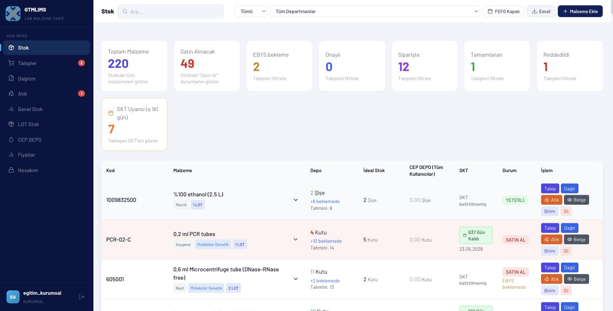
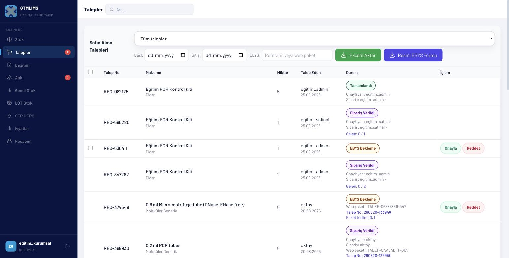
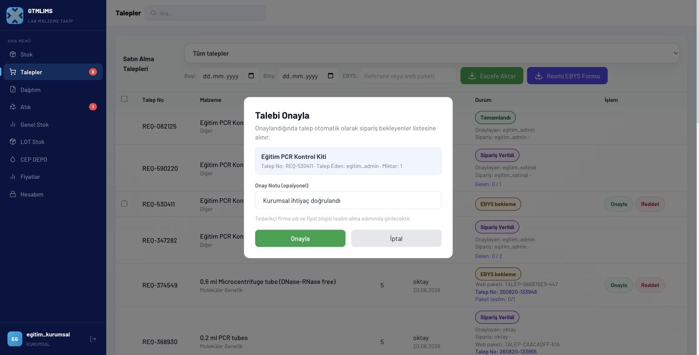
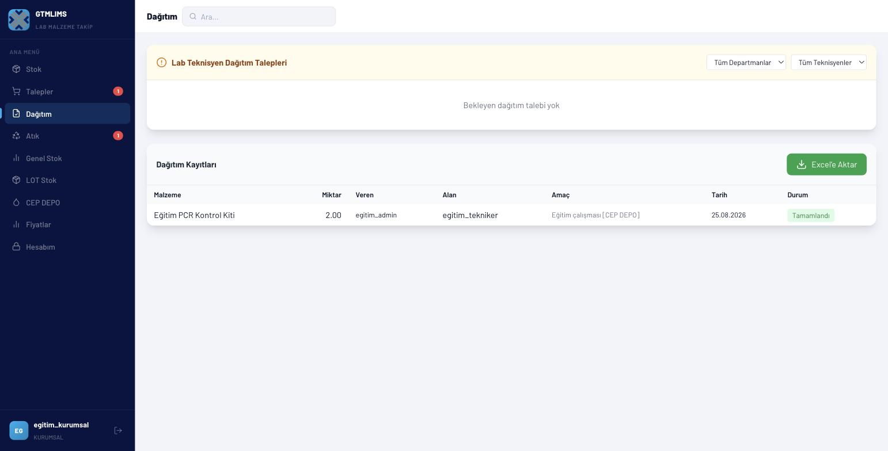
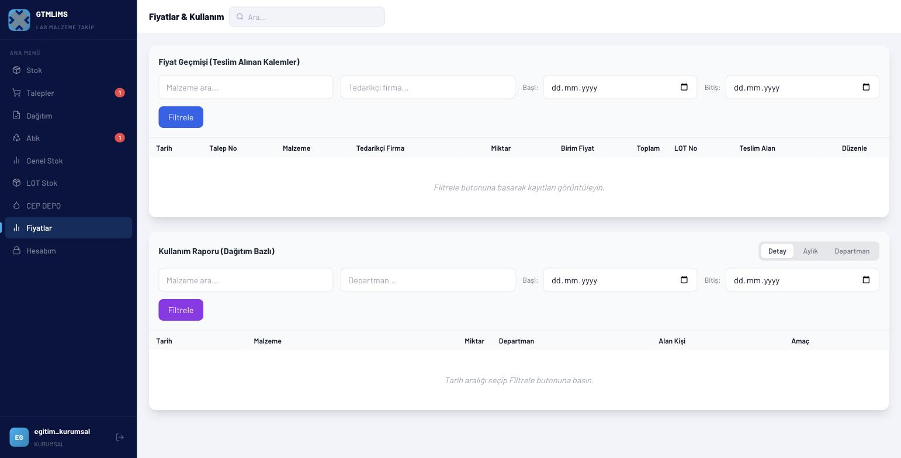
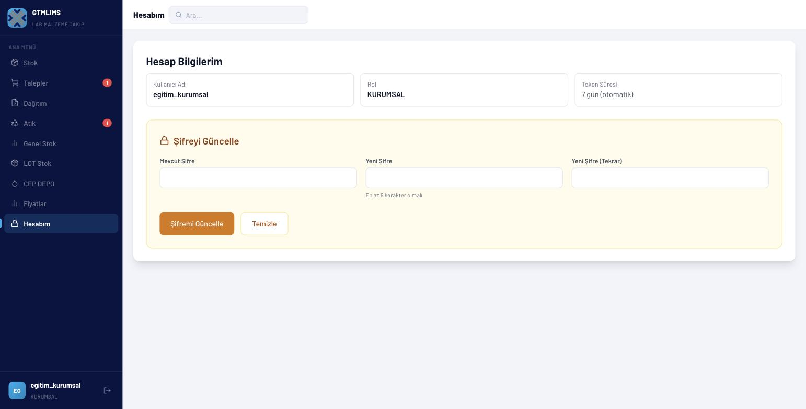

# KURUMSAL eğitim videosu

## Video kimliği

- **Başlık:** GTMLIMS Kurumsal Kullanıcı Eğitimi — Salt-Okunur Kurumsal Görünüm
- **Hedef kitle:** Kurumsal izleme, denetim ve raporlama sorumluları
- **Amaç:** Kurumsal rolün tüm operasyon kayıtlarını değiştirmeden inceleme kapsamını göstermek
- **Tahmini süre:** 11-12 dakika
- **Doğrulama:** 3 Eylül 2026'da KALITE/KURUMSAL ortak salt-okunur politikası test ve canlı API smoke testiyle doğrulandı.

## Kod/test ile doğrulanan sorumluluklar

- Tüm bölümlerin stok, LOT/SKT, talep, sipariş, teslim, dağıtım ve atık kayıtlarını görmek
- CEP DEPO bakiye, talep ve hareketlerini salt-okunur incelemek
- Fiyat ve kullanım raporlarını değiştirmeden incelemek
- ISO raporlarını indirmek
- Kullanıcı ve barkod eşleştirme listelerini salt-okunur incelemek
- Operasyon verisi oluşturmamak, onaylamamak, düzenlememek veya silmemek

## Gösterilecek sayfalar

Stok, Talepler, Siparişler, Dağıtım, Atık, Genel Stok, LOT Stok, CEP DEPO, Fiyatlar, ISO Formları, Kullanıcılar ve Hesabım. Barkod modülü açıksa Barkod Eşleştirme listesi de görünür.

## Kritik kapsam uyarısı

KURUMSAL rolünde ekleme, talep, onay, red, sipariş, teslim alma, dağıtım, tüketim, iade, fiyat/LOT düzenleme ve silme kontrolleri gösterilmez. GET dışı operasyon çağrıları sunucuda merkezi olarak `READ_ONLY_ROLE` ile reddedilir. Kişisel şifre değişimi tek istisnadır.

## Örnek senaryo

Kurumsal kullanıcı tüm bölümlerdeki kritik stokları inceler; `EGT-PCR-001` talebinin EBYS, sipariş, teslim, dağıtım ve fiyat zincirini doğrular; gerektiğinde ISO çıktısını indirir ve bulgusunu süreç sahibine iletir.

## Sahne planı ve seslendirme

### Sahne 1 — Giriş ve kurumsal kapsam (00:00-01:00)

- **Tıklama:** KURUMSAL eğitim hesabıyla giriş; menüyü ve kullanıcı kartını göster.
- **Ekran yazısı:** `KURUMSAL — Görür, karşılaştırır, değiştirmez`
- **Seslendirme:** “Kurumsal hesap bütün bölümlerdeki operasyon zincirini salt-okunur gösterir. Kayıtları karşılaştırır ve raporları indiririz; operasyon verisini değiştirmeyiz.”

### Sahne 2 — Bölümler arası stok inceleme (01:00-02:20)

- **Tıklama:** Stok > Satın Al; bölüm filtrelerini sırayla seç; `EGT-PCR-001` ara.
- **Vurgu:** Kurumsal rolün bölüm kapsamını aşan görünürlüğü.
- **Ekran yazısı:** `Bölümleri aynı ölçütle karşılaştırın`
- **Seslendirme:** “Stok ekranında Satın Al filtresiyle kritik kayıtları ayırıyoruz. Bölüm filtresini kullanarak aynı ürünün farklı laboratuvarlardaki durumunu karşılaştırabiliriz. Karar verirken ana depo, bekleyen sipariş, hedef stok ve CEP bakiyesi birlikte değerlendirilir.”

### Sahne 3 — Talep kararlarını inceleme (02:20-04:00)

- **Tıklama:** Talepler > Bekleyen; tarih/bölüm ve EBYS filtreleriyle örnek kaydı bul.
- **Ekran yazısı:** `Kararı ve gerekçeyi doğrulayın`
- **Seslendirme:** “Talepler sayfasında kayıtları tarih, bölüm ve EBYS referansıyla buluyor; talep eden, miktar, onaylayan ve gerekçeyi inceliyoruz. Onay ve red düğmeleri Kurumsal rolünde gösterilmez.”

### Sahne 4 — Resmi EBYS formu (04:00-05:20)

- **Tıklama:** EBYS paketini aç; bağlı talepleri ve resmi Talep No bilgisini incele.
- **Ekran yazısı:** `EBYS yüklemesi dış sistemde manueldir`
- **Seslendirme:** “Kurumsal kullanıcı mevcut EBYS paketini ve ona bağlı talepleri inceler. Yeni paket oluşturma ve dış EBYS onayını kaydetme işlemleri süreç sahiplerine aittir.”

### Sahne 5 — Dağıtım ve CEP görünümü (05:20-07:10)

- **Tıklama:** Dağıtım > bölüm/teknisyen filtreleri; dağıtım kayıtları. CEP DEPO > tüm bakiyeler, bekleyen talepler ve hareketler.
- **Ekran yazısı:** `Doğru LOT'tan doğru bölüme`
- **Seslendirme:** “Dağıtım ve CEP DEPO sayfalarında hedef bölümü, teknisyeni, miktarı ve hareket zincirini doğruluyoruz. Dağıtma, tamamlama, talep ve override kontrolleri Kurumsal rolünde bulunmaz.”

### Sahne 6 — Atık ve genel stok (07:10-08:20)

- **Tıklama:** Atık tablosu ve Excel; Genel Stok > Yenile.
- **Ekran yazısı:** `Operasyon sonucunu raporla doğrulayın`
- **Seslendirme:** “Atık kayıtlarında miktar, tip, gerekçe, bertaraf yöntemi ve işlemi yapan kişi izlenir. Genel Stok sayfasında Yenile’ye tıklayarak bölüm dağılımını, kritik stokları ve son yedi gün hareketlerini kontrol ediyoruz.”

### Sahne 7 — Fiyat geçmişi (08:20-10:10)

- **Tıklama/veri:** Fiyatlar > malzeme `EGT-PCR-001`, tedarikçi ve tarih; Filtrele; sonuçları belgeyle karşılaştır.
- **Vurgu:** Fiyatın teslim kaydına bağlı olması ve toplam hesap.
- **Ekran yazısı:** `Fiyat kaynağı teslim kaydıdır`
- **Seslendirme:** “Fiyatlar sayfasında sonuçları teslim belgesiyle karşılaştırıyoruz. Kurumsal kullanıcı fiyatı ve tedarikçiyi görebilir; Düzenle kontrolü gösterilmez.”

### Sahne 8 — Kullanım raporu (10:10-11:20)

- **Tıklama:** Kullanım Raporu > malzeme/bölüm/tarih > Filtrele; Detay, Aylık, Departman.
- **Ekran yazısı:** `Detay · Aylık · Departman`
- **Seslendirme:** “Aynı sayfanın Kullanım Raporu bölümünde dağıtımları malzeme, bölüm ve tarihe göre filtreliyoruz. Detay görünümü tek tek hareketleri; Aylık görünüm dönem toplamını; Departman görünümü ise bölümler arası miktarı karşılaştırır. Bu rapor tüketim kararına destek olur, stok düzeltmesi yapmaz.”

### Sahne 9 — Kapanış (11:20-12:00)

- **Tıklama:** Hesabım ve çıkış.
- **Ekran yazısı:** `İzle, doğrula, raporla`
- **Seslendirme:** “Kurumsal rolde stoktan teslimata kadar bütün zinciri inceledik. Bir tutarsızlıkta veriyi değiştirmeden kanıtı süreç sahibine iletiyoruz.”

## Dikkat noktaları ve hatalar

- KURUMSAL operasyonel olarak KALITE ile aynı merkezi salt-okunur politikaya tabidir.
- Arayüzde yazma düğmesi görünmemeli; doğrudan yazma API çağrısı `403 READ_ONLY_ROLE` dönmelidir.
- Kullanıcı listesi görünür, kullanıcı ve bölüm yönetim formları görünmez.
- Kişisel şifre değişimi Hesabım sayfasından yapılabilir.

## Kapanış metni

“Kurumsal rol bütün bölümlerdeki kayıt zincirini görür ve karşılaştırır; hiçbir operasyon kaydını değiştirmez. Bulguyu talep numarası, LOT, tarih ve belgeyle süreç sahibine iletin.”
