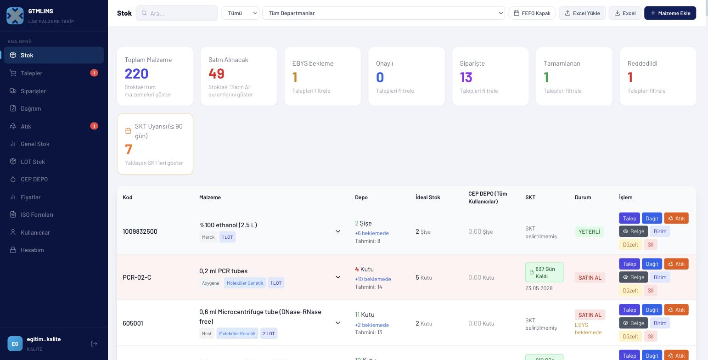
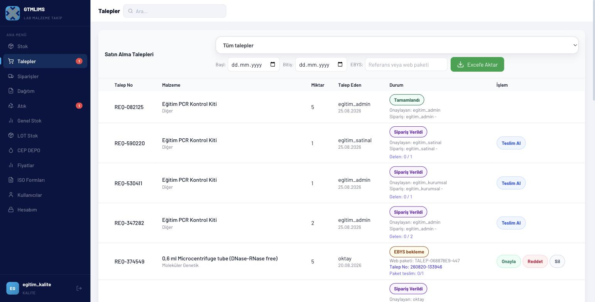
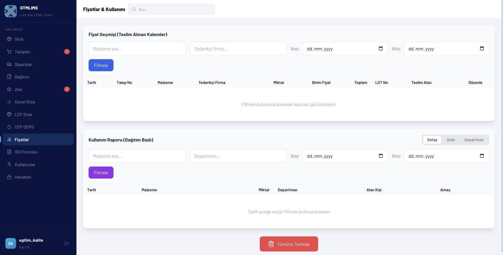
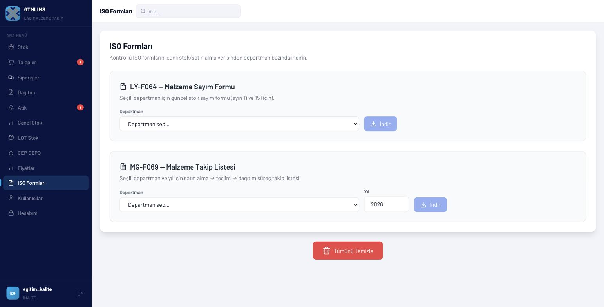
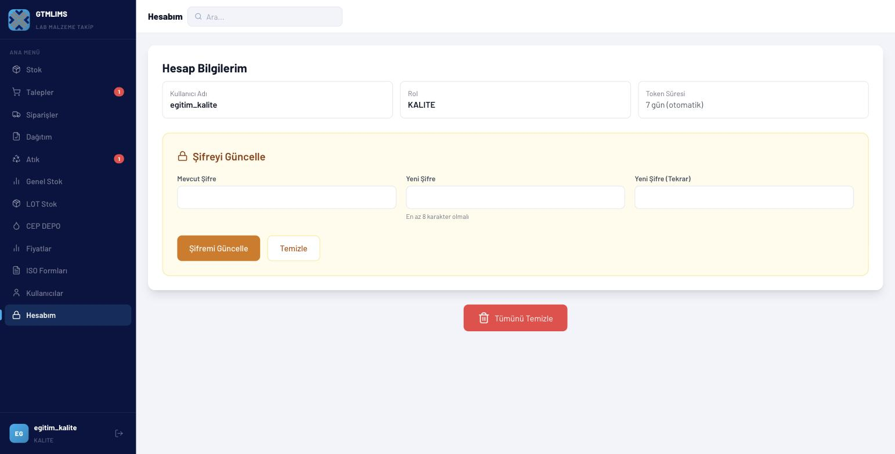

# KALITE eğitim videosu

## Video kimliği

- **Başlık:** GTMLIMS Kalite Eğitimi — Salt-Okunur Denetim ve ISO İzlenebilirliği
- **Hedef kitle:** Kalite güvence, iç denetim ve ISO dokümantasyon personeli
- **Amaç:** Tüm bölümlerde stok, talep, teslim, dağıtım, atık, fiyat ve ISO kayıtlarını değiştirmeden incelemek
- **Tahmini süre:** 9-10 dakika
- **Doğrulama:** 25 Ağustos 2026'da `egitim_kalite` eğitim hesabıyla canlı doğrulandı. 27 Ağustos rol-odaklı tasarımında başarısız yazma düğmeleri ve Kullanıcılar menüsü kaldırıldı; yeni ekran görüntüsü çekilmesi bekleniyor.

## Rolün gerçek sınırı

KALITE bütün operasyon kayıtlarını görür, fakat yazma işlemleri arayüzde gösterilmez. `src/api.js` operasyonel GET dışı çağrıları istemcide engeller; sunucu da KALITE'yi yazma izin listelerine eklemez. Güvenilir kapsam:

- Tüm bölümlerin stok ve raporlarını görüntüleme
- Talep, sipariş, dağıtım ve atık kayıtlarını inceleme
- Fiyat ve kullanım raporlarını salt-okunur inceleme
- LY-F064 ve MG-F069 dosyalarını indirme
- Veri değiştirmeme

Kullanıcılar sayfası bu role gösterilmez. Hesabım içindeki şifre değiştirme, operasyonel veri yazımı sayılmayan güvenli bir kişisel hesap işlemi olarak çalışır.

## Gösterilecek sayfalar

Stok, Talepler, Siparişler, Dağıtım, Atık, Genel Stok, LOT Stok, CEP DEPO, Fiyatlar, ISO Formları ve Hesabım. Kullanıcılar ve bütün operasyonel yazma düğmeleri menüde yer almaz.

## Örnek senaryo

Kalite kullanıcısı `EGT-PCR-001` için stok kartından LOT/SKT'yi kontrol eder; talep numarası üzerinden EBYS ve teslim zincirini izler; dağıtım ve atık kayıtlarıyla hareketi doğrular; fiyat/kullanım raporlarını inceler ve LY-F064 ile MG-F069 çıktısını indirir.

## Sahne planı ve seslendirme

### Sahne 1 — Giriş ve salt-okunur uyarı (00:00-01:10)

- **Tıklama:** KALITE eğitim hesabıyla giriş; salt-okunur menüyü ve gizlenmiş işlem alanlarını göster.
- **Ekran yazısı:** `KALITE — Görür, doğrular, değiştirmez`
- **Seslendirme:** “Kalite hesabıyla giriş yaptığımızda bütün denetim alanları görünür, fakat ekleme, onay, düzenleme, silme ve temizleme düğmeleri gösterilmez. Amacımız kayıt zincirini değiştirmeden doğrulamak ve kontrollü çıktıları almaktır.”

### Sahne 2 — Stok ve LOT doğrulama (01:10-02:40)

- **Tıklama:** Stok > arama `EGT-PCR-001`; bölüm; satırı aç. LOT Stok > LOT'lar > arama.
- **Vurgu:** Ürün kodu, bölüm, toplam, LOT, SKT ve durum.
- **Ekran yazısı:** `Kart → LOT → SKT`
- **Seslendirme:** “Stok ekranında ürün kodunu arıyor ve ilgili bölümü seçiyoruz. Ürün kartındaki toplamı, hedef stoğu ve en yakın SKT’yi not ediyoruz. LOT Stok sayfasında aynı ürünün fiziksel partilerini ayrı satırlarda doğruluyoruz. SKT denetiminde üst sayaç yerine LOT tablosu ve Raporlar görünümü esas alınmalıdır.”

### Sahne 3 — Talep ve EBYS izlenebilirliği (02:40-04:00)

- **Tıklama:** Talepler > EBYS arama; tarih; satır ayrıntısı. Siparişler > aynı referans.
- **Vurgu:** Talep No, web paketi, resmi EBYS Talep No, onaylayan/siparişe alan, durum.
- **Ekran yazısı:** `Talep No + web paketi + EBYS referansı`
- **Seslendirme:** “Talepler sayfasında talep numarası ve EBYS referansıyla kaydı buluyoruz. Talep eden, bölüm, miktar, onaylayan, web paketi ve resmi form için üretilmiş Talep No zincirini kontrol ediyoruz. Siparişler sayfasında aynı kaydın gelen ve kalan miktarını izliyoruz. İşlem düğmeleri kalite rolünde gösterilmez.”

### Sahne 4 — Teslim ve dağıtım zinciri (04:00-05:10)

- **Tıklama:** Dağıtım; bölüm/teknisyen filtreleri; dağıtım kayıtları. CEP DEPO > hareketler.
- **Vurgu:** LOT, veren/alan, tarih, bölüm, hareket tipi.
- **Ekran yazısı:** `Teslimden bölüme kadar iz sürün`
- **Seslendirme:** “Dağıtım kayıtlarında malzeme, miktar, veren, alan, amaç ve tarihi inceliyoruz. CEP DEPO hareket defteri ana depodan bölüme geçişi, tüketimi ve iadeyi ayrı hareket tipleriyle gösterir. Bir tutarsızlık varsa kaydı değiştirmek yerine talep numarası, LOT ve tarih bilgisiyle süreç sahibine bulgu açıyoruz.”

### Sahne 5 — Atık kontrolü (05:10-06:00)

- **Tıklama:** Atık; ilgili ürünü ara; tablo ve Excel düğmesini göster.
- **Vurgu:** Tip, sebep, bertaraf yöntemi, kişi, tarih, sertifika.
- **Ekran yazısı:** `Atık kaydı gerekçeli ve izlenebilir olmalı`
- **Seslendirme:** “Atık sayfasında doğru malzeme ve miktarın kaydedildiğini; atık tipi, sebep, bertaraf yöntemi, işlemi yapan kişi ve tarihin dolu olduğunu kontrol ediyoruz. Varsa sertifika numarası aynı kayıtta görünmelidir. Yeni atık oluşturma KALITE işlemi değildir.”

### Sahne 6 — Fiyat ve kullanım raporu (06:00-07:20)

- **Tıklama:** Fiyatlar > filtreler > Filtrele; salt-okunur sonuçları incele. Kullanım > Detay/Aylık/Departman.
- **Vurgu:** Belgeye dayalı fiyat, toplam, dağıtım bazlı kullanım.
- **Ekran yazısı:** `Raporu incele; veriyi değiştirme`
- **Seslendirme:** “Fiyat geçmişinde malzeme, tedarikçi ve tarihi filtreliyoruz. Miktar, birim fiyat ve toplamın teslim belgesiyle uyumunu değerlendiriyoruz. Düzenleme işlemi kalite rolünde gösterilmez. Kullanım raporunda detay, aylık ve departman görünümüyle dağıtım hareketlerinin tutarlılığını kontrol ediyoruz.”

### Sahne 7 — Genel Stok ve LOT raporları (07:20-08:10)

- **Tıklama:** Genel Stok > Yenile; LOT Stok > Raporlar.
- **Vurgu:** Kritik stok, 60 günlük SKT, departman özeti.
- **Ekran yazısı:** `Özet bulguyu ayrıntı kaydıyla doğrula`
- **Seslendirme:** “Genel Stok kartları hızlı bir özet verir. Kritik veya SKT bulgusunu LOT Stok içindeki Raporlar görünümünde ürün ve parti düzeyinde doğruluyoruz. Özet sayı ile ayrıntı farklıysa bunu raporlanan tutarsızlık olarak kaydediyoruz; doğrudan düzeltme yapmıyoruz.”

### Sahne 8 — ISO formları (08:10-09:20)

- **Tıklama:** ISO Formları > LY-F064 bölüm; İndir. MG-F069 bölüm/tüm bölümler ve yıl; İndir.
- **Vurgu:** Form parametresi, dosya adı ve indirme tarihi.
- **Ekran yazısı:** `LY-F064 sayım · MG-F069 izleme`
- **Seslendirme:** “ISO Formları sayfasında LY-F064 için denetlenecek bölümü seçip güncel sayım formunu indiriyoruz. MG-F069’da bölüm ve yılı belirliyoruz; tüm bölümler seçeneği her bölümü ayrı sayfada üretir. İndirilen dosyanın tarihini, bölümünü ve sürümünü denetim çalışma kâğıdına kaydediyoruz.”

### Sahne 9 — Kapanış ve bulgu yönetimi (09:20-10:00)

- **Tıklama:** Hesabımda kullanıcı/rol bilgisini göster; gerekirse kişisel şifreyi güncelle; çıkış.
- **Ekran yazısı:** `Bulgu aç; kaydı değiştirme`
- **Seslendirme:** “Hesabım sayfasında doğru KALITE hesabıyla çalıştığımızı doğruluyoruz. Kişisel şifremizi gerekirse burada güvenle güncelleyebiliriz. Denetim bittiğinde çıkış yapıyoruz. KALITE rolünün temel ilkesi, bulguyu kanıtla kaydetmek ve operasyon kaydını süreç sahibine bırakmaktır.”

## Dikkat noktaları ve hatalar

- Canlı KALITE hesabı 25.08.2026'da doğrulandı.
- Operasyonel yazma düğmeleri KALITE rolünde gösterilmez; doğrudan API çağrıları da engellenmeye devam eder.
- Kullanıcılar menüsü bu role kapalıdır.
- Kişisel şifre değişimi Hesabım sayfasından yapılabilir.
- Üst SKT sayacını LOT raporuyla çapraz doğrulayın.

## Kapanış metni

“KALITE rolüyle stoktan LOT’a, talepten EBYS ve teslimata, dağıtımdan atık ve ISO çıktısına kadar kayıt zincirini salt-okunur biçimde doğruladık. Bir tutarsızlık gördüğünüzde veriyi değiştirmeyin; talep numarası, LOT, tarih ve ekran kanıtıyla süreç sahibine bulgu açın.”
